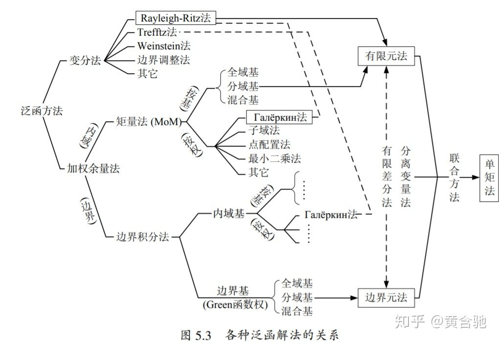

非线性泛函分析和线性泛函分析不同，他的体系是分成几块的，相互之间有些联系，但是谈不上联系非常大。

**第一部分**是「线性化」，主要涉及的是一般Banach空间上的微积分，最重要的是隐函数定理，这个定理可以引导出「连续性」方法还能证明很多偏微分方程的存在性。值得一提的是，隐函数定理有一种被nash-Moser改进的版本。那个用处也很大。

**第二部分**是不动点，不动点理论有很多种，最简单的压缩映象原理自不必说。还有一种是基于序结构的不动点。 这种方法就是pde里面一种上下解技巧的抽象版本。在椭圆形pde中具有非常大的作用。第三种是Schauder不动点 ，你可以基于Ky Fan 不等式和KKM映射把它推广到一般的多值映射中，而且你会发现这种不动点和鞍点问题息息相关，也就是说它和博弈论发生了相关。Schauder不动点的另一种发展就是拓扑度理论了，通过这种无穷维空间中的拓扑理论，可以研究各种问题的多解性，甚至能证明某些偏微分方程方程必然有无穷个解。

**第三部分**是单调算子理论，单调算子理论有线性和非线性两种。 线性单调算子理论更像泛函分析的延长线，这里不表了。我们谈谈非线性泛函分析中的单调算子理论，这种理论的核心其实是有限维逼近是Galerkin方法的一种「高级表达」，所谓单调性也可以通过伪单调等等来替换。这方面Minty-Bouwder和Brezis的结果无疑是最重要的。这个工具各种完全非线性椭圆形方程的好方法。

**第四部分**是变分法/最优化。首先是自威斯特拉斯发源的直接方法求极小值，这种方法主要依靠紧性和凸性两种基本思路，蛮有效的，可以解决一大类题目，涉及到的也不过是序列下半连续、紧、对偶泛函等等基本的东西。值得一提的是很多最优化问题/变分问题和最大单调算子是息息相关的。简单的说把，一个变分问题等价于某个最大单调算子方程的存在性。变分法的下一个主要思路是「拉格朗日乘子法」，主要解决是各种带有（光滑）限制条件的变分问题。后续的发展包括了 Ljusternik-Schirelman理论，这些东西在研究分歧理论，特征值问题，周期震动问题上特别有效。失去了光滑限制，而是更一般的限制的时候，那就需要依靠凸分析技巧了，你可以得到Kuhn-Tucker理论，Dobovickii-Miljutin理论。后者可以看成是一种广义的拉格朗日乘子法。

***
“Functional Analysis (泛函分析)，通俗地，可以理解为微积分从有限维空间到无限维空间的拓展——当然了，它实际上远不止于此。在这个地方，函数以及其所作用的对象之间存在的对偶关系扮演了非常重要的角色。Learning发展至今，也在向无限维延伸——从研究有限维向量的问题到以无限维的函数为研究对象。Kernel Learning 和 Gaussian Process 是其中典型的例子——其中的核心概念都是Kernel。很多做Learning的人把Kernel简单理解为Kernel trick的运用，这就把kernel的意义严重弱化了。在泛函里面，Kernel (Inner Product)是建立整个博大的代数体系的根本，从metric, transform到spectrum都根源于此。

  

