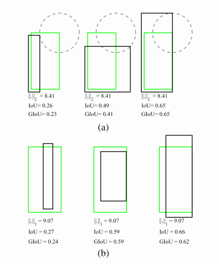
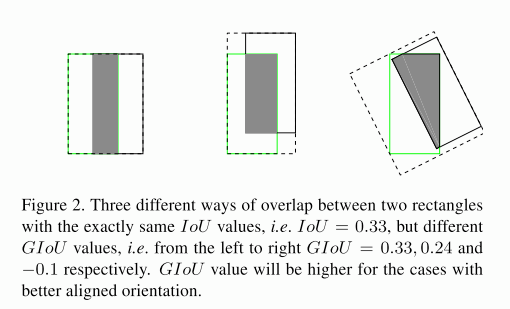
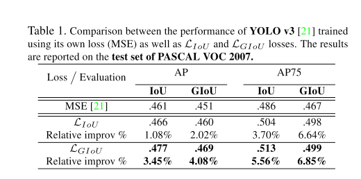
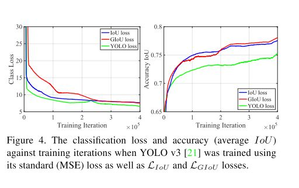
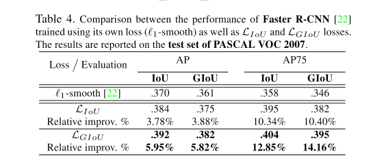

本文是对CVPR2019论文[Generalized Intersection over Union: A Metric and A Loss for Bounding Box Regression](https://link.zhihu.com/?target=https%3A//arxiv.org/abs/1902.09630) 的解读，通过对Loss的修改提升检测任务的效果，觉得思路很棒

IoU是检测任务中最常用的指标，由于IoU是比值的概念，对目标物体的scale是不敏感的。然而检测任务中的BBox的回归损失(MSE loss, I1-smooth loss等）优化和IoU优化不是完全等价的（见下图）。而且$L_n$范数对物体的scale也比较敏感。这篇论文提出可以直接把IoU设为回归的loss。然而有个问题是IoU无法直接优化没有重叠的部分。为了解决这个问题这篇paper提出了GIoU的思想~

   IoU与L2范数的优化不是等效的 

要将IoU设计为损失，主要需要解决两个问题：

1. 预测值和Ground truth没有重叠的话，IoU始终为0且无法优化
2. IoU无法辨别不同方式的对齐，比如方向不一致等。

   IoU无法代表overlap的方式 

# GIoU

所以论文中提出的新GIoU是怎么设计的呢：

假如现在有两个任意性质 A，B，我们找到一个最小的封闭形状C，让C可以把A，B包含在内，然后我们计算C中没有覆盖A和B的面积占C总面积的比值，然后用A与B的IoU减去这个比值：
$$GIoU=IoU-\frac{|(A\cup B)^\complement|}{|C|}$$

GIoU有如下性质：

1. 与IoU类似，GIoU也可以作为一个距离，loss可以用 $L_{GIoU}=1-GIoU$ 来计算
2. 同原始IoU类似，GIoU对物体的大小不敏感
3. GIoU总是小于等于IoU，对于IoU，有 $0\leq IoU \leq 1$ ,GIoU则是 $-1\leq GIoU \leq 1$ 。在两个形状完全重合时，有 $GIoU=IoU=1$
4. 由于GIoU引入了包含A，B两个形状的C，所以当A，B不重合时，依然可以进行优化。

总之就是保留了IoU的原始性质同时弱化了它的缺点。于是论文认为可以将其作为IoU的替代。

# GIoU作为BBox回归的损失

那么具体一点，如何计算损失呢？我们以2D detecation为例：

假设我们现在有预测的Bbox和groud truth的Bbox的坐标，分别记为：$B^p=(x_1^p,y_1^p,x_2^p,y_2^p),B^g=(x_1^g,y_1^g,x_2^g,y_2^g)$

注意我们规定对于预测的BBox来说，有$x_2^p >x_1^p,y_2^p>y_1^p$,主要是为了方便之后点的对应关系。

1. 计算 $B^g$ 的面积：$A^g = (x_2^g-x_1^g) *(y_2^g-y_1^g)$
2. 计算 $B^p$ 的面积：$A^p = (x_2^p-x_1^p) *(y_2^p-y_1^p)$
3. 计算 $B^p,B^g$ 的重叠面积：
$$x_1^I = max(\hat x_1^p, x_1^g), x_2^I = min(\hat x_2^p, x_2^g) \\ y_1^I = max(\hat y_1^p,y_1^g), x_2^I = min(\hat y_2^p, y_2^g) \\ I = \begin{cases}(x_2^I-x_1^I)*(y_2^I-y_1^I) & x_2^I>x_1^I, y_2^I>y_1^I\\ 0 &otherwise& \end{cases} $$

4. 找到可以包含$B^p,B^g$的最小box$B^c$
$$x_1^c = min(\hat x_1^p, x_1^g), x_2^c = max(\hat x_2^p, x_2^g)\\ y_1^c = min(\hat y_1^p,y_1^g), x_2^c = max(\hat y_2^p, y_2^g) \\$$

5. 计算$B^c$的面积：
$$A^c = (x_2^c-x_1^c) *(y_2^c-y_1^c) \\$$

6. 计算IoU: $IoU = \frac{I}{U}=\frac{I}{A^p+A^g - I}$

7. 计算 $GIoU = IoU - \frac{A^c - U}{A^c}$

8. 计算最终的损失：$L_{GIoU} = 1 - GIoU$

作者做了一系列的实验（针对分割任务和分类任务有一定loss的调整设计，不过论文中没有详细给出）结果是IoU loss可以轻微提升使用MSE作为loss的表现，而GIoU的提升幅度更大，这个结论在YOLO算法和faster R-CNN系列上都是成立的：

  PASCAL VOC 2007上的提升with Yolo 

   MS COCO的提升with Yolo
 

 
  PASCAL VOC 2007 with faster-RCNN 

# 实际运行
在人脸检测中使用了GIoU替代原始损失，发现改进效果不大，分析原因可能是人脸检测中Anchor box的比例一般变动不大（1.5:1)，而不是像多目标检测一样存在anchor box比例分布不均衡的情况。