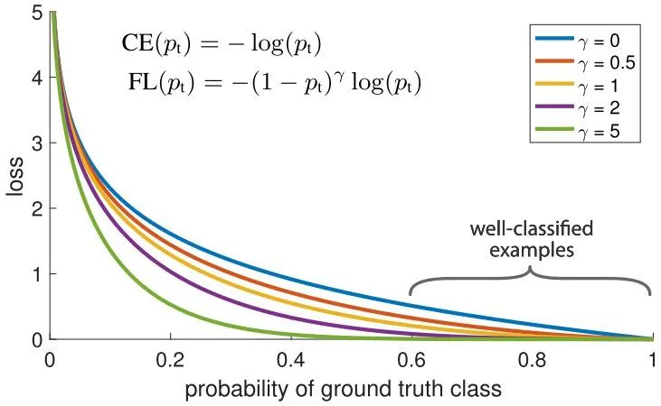
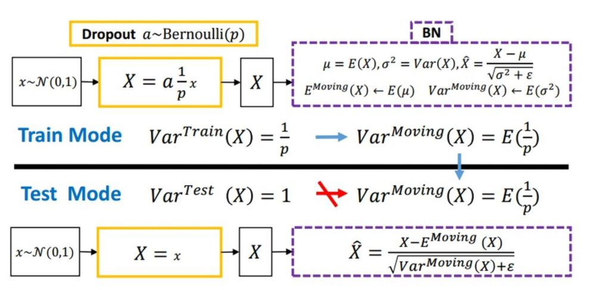
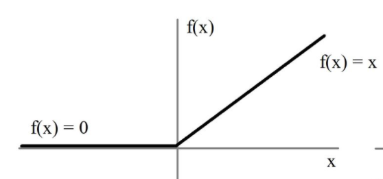
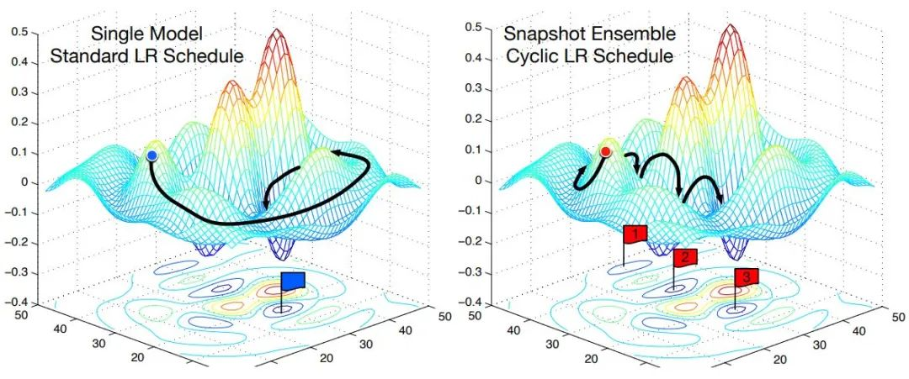
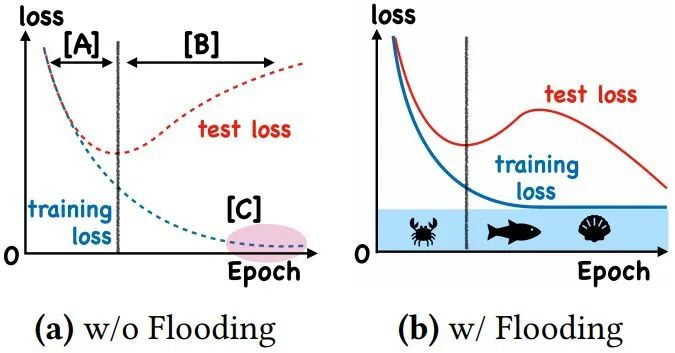
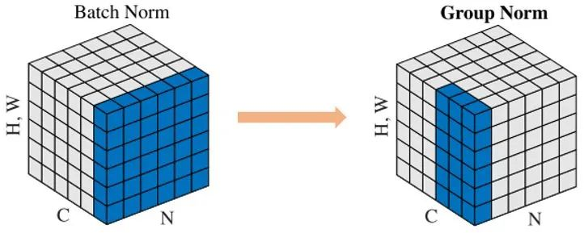
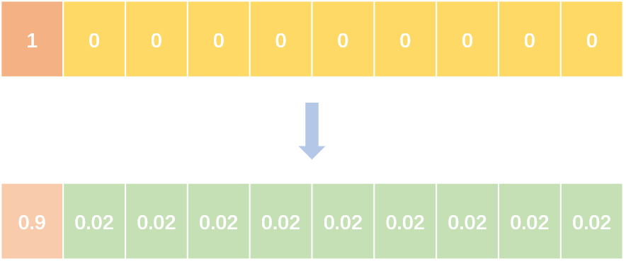
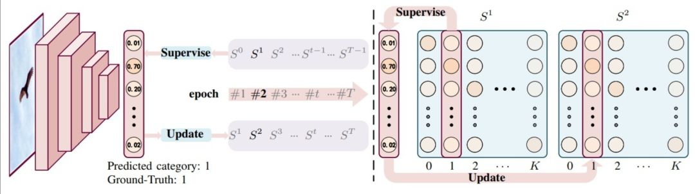
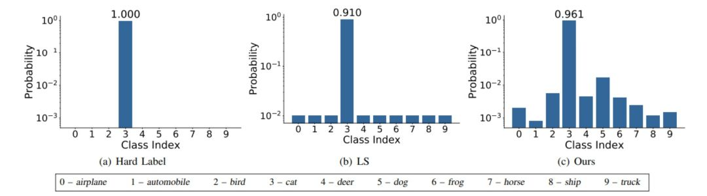
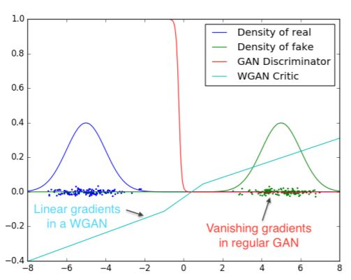

# Focal Loss

<div align="center">  </div>

针对类别不平衡问题，用预测概率对不同类别的loss进行加权。Focal loss对CE loss增加了一个调制系数来降低容易样本的权重值，使得训练过程更加关注困难样本。

$$loss = -np.log(p)$$
$$loss = (1-p)^G * loss$$

# Dropout

<div align="center">  </div>

随机丢弃，抑制过拟合，提高模型鲁棒性。

# Normalization

Batch Normalization 于2015年由 Google 提出，开 Normalization 之先河。其规范化针对单个神经元进行，利用网络训练时一个 mini-batch 的数据来计算该神经元的均值和方差,因而称为 Batch Normalization。

$$x = (x - x.mean()) / x.std()$$

# relu

<div align="center">  </div>

用极简的方式实现非线性激活，缓解梯度消失。

$$x = max(x, 0)$$

# Cyclic LR

<div align="center">  </div>

每隔一段时间重启学习率，这样在单位时间内能收敛到多个局部最小值，可以得到很多个模型做集成。

```
scheduler = lambda x: ((LR_INIT-LR_MIN)/2)*(np.cos(PI*(np.mod(x-1,CYCLE)/(CYCLE)))+1)+LR_MIN
```

# With Flooding

<div align="center">  </div>

当training loss大于一个阈值时，进行正常的梯度下降；当training loss低于阈值时，会反过来进行梯度上升，让training loss保持在一个阈值附近，让模型持续进行“random walk”，并期望模型能被优化到一个平坦的损失区域，这样发现test loss进行了double decent。

$$flood = (loss - b).abs() + b$$

# Group Normalization

<div align="center">  </div>

Face book AI research（FAIR）吴育昕-恺明联合推出重磅新作Group Normalization（GN），提出使用Group Normalization 替代深度学习里程碑式的工作Batch normalization。一句话概括，Group Normbalization（GN）是一种新的深度学习归一化方式，可以替代BN。

```
def GroupNorm(x, gamma, beta, G, eps=1e-5):    
    # x: input features with shape [N,C,H,W]
    # gamma, beta: scale and offset, with shape [1,C,1,1]    
    # G: number of groups for GN    
    N, C, H, W = x.shape    
    x = tf.reshape(x, [N, G, C // G, H, W])    
    mean, var = tf.nn.moments(x, [2, 3, 4], keep dims=True)    
    x = (x - mean) / tf.sqrt(var + eps)    
    x = tf.reshape(x, [N, C, H, W])    
    return x * gamma + beta
```

# Label Smoothing

<div align="center">  </div>

<div align="center">  </div>

abel smoothing将hard label转变成soft label，使网络优化更加平滑。标签平滑是用于深度神经网络（DNN）的有效正则化工具，该工具通过在均匀分布和hard标签之间应用加权平均值来生成soft标签。它通常用于减少训练DNN的过拟合问题并进一步提高分类性能。

$$targets = (1 - label_smooth) * targets + label_smooth / num_classes$$

<div align="center">  </div>

# Wasserstein GAN

<div align="center">  </div>

- 彻底解决GAN训练不稳定的问题，不再需要小心平衡生成器和判别器的训练程度
- 基本解决了Collapse mode的问题，确保了生成样本的多样性
- 训练过程中终于有一个像交叉熵、准确率这样的数值来指示训练的进程，数值越小代表GAN训练得越好，代表生成器产生的图像质量越高
- 不需要精心设计的网络架构，最简单的多层全连接网络就可以做到以上3点。
  
# Skip Connection

一种网络结构，提供恒等映射的能力，保证模型不会因网络变深而退化。

$$F(x) = F(x) + x$$

# 参考文献:

https://www.zhihu.com/question/427088601
https://arxiv.org/pdf/1701.07875.pdf
https://zhuanlan.zhihu.com/p/25071913
https://www.zhihu.com/people/yuconan/posts
