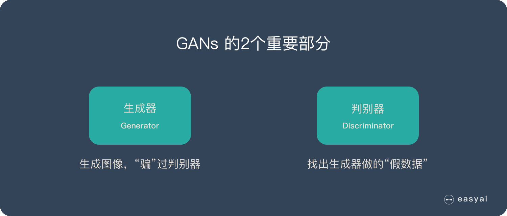
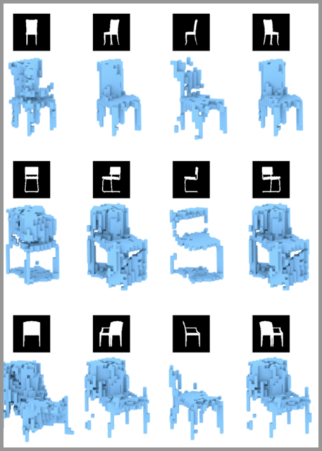

[toc]

生成对抗网络 – GAN 是最近2年很热门的一种无监督算法,他能生成出非常逼真的照片,图像甚至视频.我们手机里的照片处理软件中就会使用到它.

本文将详细介绍生成对抗网络 – GAN 的设计初衷、基本原理、10种典型算法和13种实际应用.

# GAN的设计初衷

一句话来概括 GAN 的设计动机就是--自动化.

## 人工提取特征-->自动提取特征

我们在[《一文看懂深度学习（概念+优缺点+典型算法）》](https://easyai.tech/ai-definition/deep-learning/)中讲过,深度学习最特别最厉害的地方就是能够自己学习特征提取.

  

机器的超强算力可以解决很多人工无法解决的问题.自动化后,学习能力更强,适应性也更强.

## 人工判断生成结果的好坏-->自动判断和优化

我们在[《监督学习》](https://easyai.tech/ai-definition/supervised-learning/)中讲过,训练集需要大量的人工标注数据,这个过程是成本很高且效率很低的.而人工判断生成结果的好坏也是如此,有成本高和效率低的问题.

而 GAN 能自动完成这个过程,且不断的优化,这是一种效率非常高,且成本很低的方式.GAN是如何实现自动化的呢？下面我们讲解一下他的原理.

# 生成对抗网络 GAN 的基本原理

## 大白话版本

知乎上有一个很不错的解释,大家应该都能理解:

假设一个城市治安混乱,很快,这个城市里就会出现无数的小偷.在这些小偷中,有的可能是盗窃高手,有的可能毫无技术可言.假如这个城市开始整饬其治安,突然开展一场打击犯罪的「运动」,警察们开始恢复城市中的巡逻,很快,一批「学艺不精」的小偷就被捉住了.之所以捉住的是那些没有技术含量的小偷,是因为警察们的技术也不行了,在捉住一批低端小偷后,城市的治安水平变得怎样倒还不好说,但很明显,城市里小偷们的平均水平已经大大提高了.

  

警察们开始继续训练自己的破案技术,开始抓住那些越来越狡猾的小偷.随着这些职业惯犯们的落网,警察们也练就了特别的本事,他们能很快能从一群人中发现可疑人员,于是上前盘查,并最终逮捕嫌犯；小偷们的日子也不好过了,因为警察们的水平大大提高,如果还想以前那样表现得鬼鬼祟祟,那么很快就会被警察捉住.

  

为了避免被捕,小偷们努力表现得不那么「可疑」,而魔高一尺、道高一丈,警察也在不断提高自己的水平,争取将小偷和无辜的普通群众区分开.随着警察和小偷之间的这种「交流」与「切磋」,小偷们都变得非常谨慎,他们有着极高的偷窃技巧,表现得跟普通群众一模一样,而警察们都练就了「火眼金睛」,一旦发现可疑人员,就能马上发现并及时控制——最终,我们同时得到了最强的小偷和最强的警察.

  

## 非大白话版本

生成对抗网络（GAN）由2个重要的部分构成:

- **成器(Generator)**:通过机器生成数据（大部分情况下是图像）,目的是“骗过”判别器
- **判别器(Discriminator)**:判断这张图像是真实的还是机器生成的,目的是找出生成器做的“假数据”

  

下面详细介绍一下过程:

**第一阶段:固定「判别器D」,训练「生成器G」**

我们使用一个还 OK 判别器,让一个「生成器G」不断生成“假数据”,然后给这个「判别器D」去判断.

一开始,「生成器G」还很弱,所以很容易被揪出来.

但是随着不断的训练,「生成器G」技能不断提升,最终骗过了「判别器D」.

到了这个时候,「判别器D」基本属于瞎猜的状态,判断是否为假数据的概率为50%.

  

**第二阶段:固定「生成器G」,训练「判别器D」**

当通过了第一阶段,继续训练「生成器G」就没有意义了.这个时候我们固定「生成器G」,然后开始训练「判别器D」.

「判别器D」通过不断训练,提高了自己的鉴别能力,最终他可以准确的判断出所有的假图片.

到了这个时候,「生成器G」已经无法骗过「判别器D」.

  

**循环阶段一和阶段二**

通过不断的循环,「生成器G」和「判别器D」的能力都越来越强.

最终我们得到了一个效果非常好的「生成器G」,我们就可以用它来生成我们想要的图片了.

下面的实际应用部分会展示很多“惊艳”的案例.

  

如果对 GAN 的详细技术原理感兴趣,可以看看下面2篇文章:

- [《生成性对抗网络（GAN）初学者指南 – 附代码》](https://easyai.tech/blog/generative-adversarial-networks-gans-a-beginners-guide/)

- [《长文解释生成对抗网络GAN的详细原理（20分钟阅读）》](https://easyai.tech/blog/understanding-generative-adversarial-networks-gans/)

# GAN的优缺点

## 3个优势
1. 能更好建模数据分布（图像更锐利、清晰）
2. 理论上,GANs 能训练任何一种生成器网络.其他的框架需要生成器网络有一些特定的函数形式,比如输出层是高斯的.
3. 无需利用马尔科夫链反复采样,无需在学习过程中进行推断,没有复杂的变分下界,避开近似计算棘手的概率的难题.
## 2个缺陷
1. 难训练,不稳定.生成器和判别器之间需要很好的同步,但是在实际训练中很容易D收敛,G发散.D/G 的训练需要精心的设计.
2. 模式缺失（Mode Collapse）问题.GANs的学习过程可能出现模式缺失,生成器开始退化,总是生成同样的样本点,无法继续学习.

扩展阅读:[《为什么训练生成对抗网络如此困难？》](https://easyai.tech/blog/gan-why-it-is-so-hard-to-train/)阅读这篇文章对数学要求很高

# 10大典型的GAN算法

GAN 算法有数百种之多,大家对于 GAN 的研究呈指数级的上涨,目前每个月都有数百篇论坛是关于对抗网络的.

如果你对 GANs 算法感兴趣,可以在 [「GANs动物园」](https://github.com/hindupuravinash/the-gan-zoo)里查看几乎所有的算法.我们为大家从众多算法中挑选了10个比较有代表性的算法,技术人员可以看看他的论文和代码.

|算法|论文|代码
| --- | --- | --- |
GAN|[论文地址](https://arxiv.org/abs/1406.2661)|[代码地址](https://github.com/goodfeli/adversarial)
DCGAN|[论文地址](https://arxiv.org/abs/1511.06434)|[代码地址](https://github.com/floydhub/dcgan)
CGAN|[论文地址](https://arxiv.org/abs/1411.1784)|[代码地址](https://github.com/PacktPublishing/Advanced-Deep-Learning-with-Keras)
CycleGAN|[论文地址](https://arxiv.org/abs/1703.10593v6)|[代码地址](https://github.com/junyanz/CycleGAN)
CoGAN|[论文地址](https://arxiv.org/abs/1606.07536)|[代码地址](https://github.com/mingyuliutw/CoGAN)
ProGAN|[论文地址](https://arxiv.org/abs/1710.10196)|[代码地址](https://github.com/tkarras/progressive_growing_of_gans)
WGAN|[论文地址](https://arxiv.org/abs/1701.07875v3)|[代码地址](https://github.com/eriklindernoren/Keras-GAN)
SAGAN|[论文地址](https://arxiv.org/abs/1805.08318v1)|[代码地址](https://github.com/heykeetae/Self-Attention-GAN)
BigGAN|[论文地址](https://arxiv.org/abs/1809.11096v2)|[代码地址](https://github.com/huggingface/pytorch-pretrained-BigGAN)

上面内容整理自[《Generative Adversarial Networks – The Story So Far》](https://blog.floydhub.com/gans-story-so-far/)原文中对算法有一些粗略的说明,感兴趣的可以看看.

# GAN 的13种实际应用
GAN 看上去不如「语音识别」「文本挖掘」那么直观.不过他的应用已经进入到我们的生活中了.下面给大家列举一些 GAN 的实际应用.

## 生成图像数据集

人工智能的训练是需要大量的数据集的,如果全部靠人工收集和标注,成本是很高的.GAN 可以自动的生成一些数据集,提供低成本的训练数据.

  

## 生成人脸照片

生成人脸照片是大家很熟悉的应用,但是生成出来的照片用来做什么是需要思考的问题.因为这种人脸照片还处于法律的边缘.

  

## 生成照片、漫画人物

GAN 不但能生成人脸,还能生成其他类型的照片,甚至是漫画人物.

  

  

## 图像到图像的转换

简单说就是把一种形式的图像转换成另外一种形式的图像,就好像加滤镜一样神奇.例如:

- 把草稿转换成照片
- 把卫星照片转换为Google地图的图片
- 把照片转换成油画
- 把白天转换成黑夜

  

## 文字到图像的转换

在2016年标题为“[StackGAN:使用 StackGAN 的文本到逼真照片的图像合成](https://arxiv.org/abs/1612.03242)”的论文中,演示了使用 GAN,特别是他们的 StackGAN,从鸟类和花卉等简单对象的文本描述中生成逼真的照片.

  

## 语意到图像的转换

在2017年标题为“[高分辨率图像合成和带条件GAN的语义操纵](https://arxiv.org/abs/1711.11585)”的论文中,演示了在语义图像或草图作为输入的情况下使用条件GAN生成逼真图像.

  

## 自动生成模特

在2017年标题为“[姿势引导人形象生成](https://arxiv.org/abs/1705.09368)”的论文中,可以自动生成人体模特,并且使用新的姿势.

  

## 照片到Emojis

GANs 可以通过人脸照片自动生成对应的表情（Emojis）.

  

## 照片编辑

使用GAN可以生成特定的照片,例如更换头发颜色、更改面部表情、甚至是改变性别.

  

## 预测不同年龄的长相

给一张人脸照片, GAN 就可以帮你预测不同年龄阶段你会长成什么样.

  

## 提高照片分辨率,让照片更清晰

给GAN一张照片,他就能生成一张分辨率更高的照片,使得这个照片更加清晰.

  

## 照片修复

假如照片中有一个区域出现了问题（例如被涂上颜色或者被抹去）,GAN可以修复这个区域,还原成原始的状态.

  

## 自动生成3D模型

给出多个不同角度的2D图像,就可以生成一个3D模型.

  

