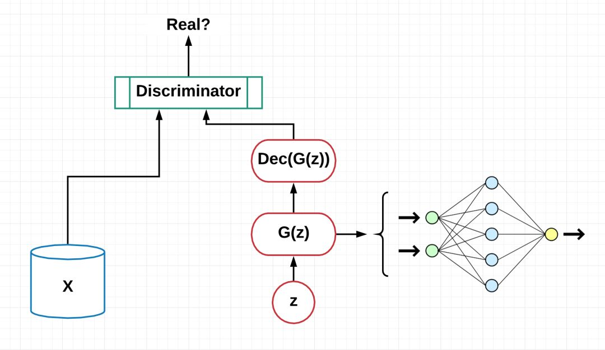

[toc]
# 简介

  

**生成对抗网络**（Generative Adversarial Network，简称GAN）是非监督式学习的一种方法，通过让两个神经网络相互博弈的方式进行学习。

生成对抗网络由一个生成网络与一个判别网络组成。生成网络从潜在空间（latent space）中随机采样作为输入，其输出结果需要尽量模仿训练集中的真实样本。判别网络的输入则为真实样本或生成网络的输出，其目的是将生成网络的输出从真实样本中尽可能分辨出来。而生成网络则要尽可能地欺骗判别网络。两个网络相互对抗、不断调整参数，最终目的是使判别网络无法判断生成网络的输出结果是否真实。

# 论文

这一章节是关于近年来GAN的相关发表论文。
## 类型及模型

---
**Core: Generative Adversarial Networks(VanillaGAN)**

---
论文1：Generative Adversarial Nets

文章地址：http://papers.nips.cc/paper/5423-generative-adversarial-nets.pdf

代码地址：https://github.com/goodfeli/adversarial

论文2：ENERGY-BASED GENERATIVE ADVERSARIAL NETWORK

文章地址：https://arxiv.org/pdf/1609.03126v2.pdf

代码地址：https://github.com/buriburisuri/ebgan

论文3：Which Training Methods for GANs do Actually Converge

文章地址：https://arxiv.org/pdf/1801.04406.pdf

代码地址：https://github.com/LMescheder/GAN_stability

---
**Conditional Generative Adversarial Networks (CGAN)**
---

论文1：Conditional generative adversarial nets

文章地址：https://arxiv.org/abs/1411.1784

代码地址：https://github.com/zhangqianhui/Conditional-GAN

论文2：Photo-realistic single image super-resolution using a GAN

文章地址：https://arxiv.org/pdf/1609.04802.pdf

代码地址：https://github.com/tensorlayer/srgan

论文3：Image-to-Image Translation with Conditional Adversarial Networks

文章地址：https://arxiv.org/abs/1611.07004

代码地址：https://github.com/phillipi/pix2pix

论文4：Generative Visual Manipulation on the Natural Image Manifold

文章地址：https://arxiv.org/abs/1609.03552

代码地址：https://github.com/junyanz/iGAN

---
**Laplacian Pyramid of Adversarial Networks (LAPGAN)**

---
论文1：Deep Generative Image Models using a Laplacian Pyramid of Adversarial Networks

文章地址：http://papers.nips.cc/paper/5773-deep-generative-image-models-using-a-laplacian-pyramid-of-adversarial-networks.pdf

代码地址：https://github.com/witnessai/LAPGAN

---
**Deep Convolutional Generative Adversarial Networks (DCGAN)**

---
论文1：Deep Convolutional Generative Adversarial Networks

文章地址：http://papers.nips.cc/paper/5773-deep-generative-image-models-using-a-laplacian-pyramid-of-adversarial-networks.pdf

代码地址：https://github.com/witnessai/LAPGAN

论文2：Generative Adversarial Text to Image Synthesis

文章地址：https://arxiv.org/pdf/1605.05396.pdf

代码地址：https://github.com/reedscot/icml2016

---
**Adversarial Autoencoders (AAE)**

---
论文1：Adversarial Autoencoders

文章地址：https://arxiv.org/abs/1511.05644

代码地址：https://github.com/Naresh1318/Adversarial_Autoencoder

---
**Generative Recurrent Adversarial Networks (GRAN)**

---
论文1：Generating images with recurrent adversarial networks

文章地址：https://arxiv.org/abs/1602.05110

代码地址：https://github.com/jiwoongim/GRAN

---
**Information Maximizing Generative Adversarial Networks (InfoGan)**

---

论文1：Infogan: Information maximizing GANs

文章地址：http://papers.nips.cc/paper/6399-infogan-interpretable-representation

代码地址：https://github.com/openai/InfoGAN

---
**Bidirectional Generative Adversarial Networks (BiGan)**

---

论文1：Adversarial feature learning

文章地址：https://arxiv.org/abs/1605.09782

代码地址：https://github.com/jeffdonahue/bigan

## 应用

---
**GANs理论和训练 Theory and Tranining**

---
论文1：Energy-based generative adversarial network

文章地址：https://arxiv.org/pdf/1609.03126v2.pdf

代码地址：https://github.com/buriburisuri/ebgan

论文2：Which Training Methods for GANs do actually Converge

文章地址：https://arxiv.org/pdf/1801.04406.pdf

代码地址：https://github.com/LMescheder/GAN_stability

论文3：Improved Techniques for Training GANs

文章地址：https://arxiv.org/abs/1609.04468

代码地址：https://github.com/openai/improved-gan

论文4：Towards Principled Methods for Training Generative Adversarial Networks

文章地址：https://arxiv.org/abs/1701.04862

论文5：Least Squares Generative Adversarial Networks

文章地址：https://arxiv.org/abs/1611.04076

代码地址：https://github.com/pfnet-research/chainer-LSGAN

论文6：Wasserstein GAN

文章地址：https://arxiv.org/abs/1701.07875

代码地址：https://github.com/martinarjovsky/WassersteinGAN

论文7：Improved Training of Wasserstein GANs

文章地址：https://arxiv.org/abs/1704.00028

代码地址：https://github.com/igul222/improved_wgan_training

论文8：Generalization and Equilibrium in Generative Adversarial Nets

文章地址：https://arxiv.org/abs/1703.00573

论文9：GANs Trained by a Two Time-Scale Update Rule Converge to a Local Nash Equilibrium

文章地址：https://arxiv.org/abs/1605.09782

代码地址：https://github.com/bioinf-jku/TTUR

论文10：Spectral Normalization for Generative Adversarial Networks

文章地址：https://openreview.net/forum?id=B1QRgziT-

代码地址：https://github.com/minhnhat93/tf-SNDCGAN

---
**图像合成 Image Synthesis**

---

论文1：Generative Adversarial Text to Image Synthesis

文章地址：https://arxiv.org/abs/1605.05396

代码地址：https://github.com/reedscot/icml201

论文2：Plug & Play Generative Networks: Conditional Iterative Generation of Images in Latent Space

文章地址：https://arxiv.org/abs/1612.00005v1

代码地址：https://github.com/Evolving-AI-Lab/ppgn

论文3：Unsupervised Representation Learning with Deep Convolutional Generative Adversarial Networks

文章地址：https://arxiv.org/abs/1511.06434

代码地址：https://github.com/jacobgil/keras-dcgan

论文4：Progressive Growing of GANs for Improved Quality, Stability, and Variation

文章地址：http://research.nvidia.com/publication/2017-10_Progressive-Growing-of

代码地址：https://github.com/tkarras/progressive_growing_of_gans

论文5：StackGAN: Text to Photo-realistic Image Synthesis with Stacked Generative Adversarial Networks

文章地址：https://arxiv.org/pdf/1612.03242v1.pdf

代码地址：https://github.com/hanzhanggit/StackGAN

论文6：Self-Attention Generative Adversarial Networks

文章地址：https://arxiv.org/abs/1805.08318

代码地址：https://github.com/heykeetae/Self-Attention-GAN

论文7：Large Scale GAN Training for High Fidelity Natural Image Synthesis

文章地址：https://arxiv.org/abs/1809.11096

---
**图像翻译 Image-to-image translation**

---

论文1：Image-to-image translation using conditional adversarial nets

文章地址：https://arxiv.org/pdf/1611.07004v1.pdf

代码地址：https://github.com/phillipi/pix2pix

论文2：Learning to Discover Cross-Domain Relations with Generative Adversarial Networks

文章地址：https://arxiv.org/abs/1703.05192

代码地址：https://github.com/carpedm20/DiscoGAN-pytorch

论文3：Unpaired Image-to-Image Translation using Cycle-Consistent Adversarial Networks

文章地址：https://junyanz.github.io/CycleGAN/

代码地址：https://github.com/junyanz/CycleGAN

论文4：CoGAN: Coupled Generative Adversarial Networks

文章地址：https://arxiv.org/abs/1606.07536

代码地址：https://github.com/andrewliao11/CoGAN-tensorflow

论文5：Unsupervised Image-to-Image Translation Networks

文章地址：https://arxiv.org/abs/1703.00848

论文6：High-Resolution Image Synthesis and Semantic Manipulation with Conditional GANs

文章地址：https://arxiv.org/abs/1711.11585

论文7：UNIT: UNsupervised Image-to-image Translation Networks

文章地址：https://arxiv.org/abs/1703.00848

代码地址：https://github.com/mingyuliutw/UNIT

论文8：Multimodal Unsupervised Image-to-Image Translation

文章地址：https://arxiv.org/abs/1804.04732

代码地址：https://github.com/nvlabs/MUNIt

---
**超像素 Super-resolution**

---
论文1：Photo-Realistic Single Image Super-Resolution Using a Generative Adversarial Network

文章地址：https://arxiv.org/abs/1609.04802

代码地址：https://github.com/leehomyc/Photo-Realistic-Super-Resoluton

论文2：High-Quality Face Image Super-Resolution Using Conditional Generative Adversarial Networks

文章地址：https://arxiv.org/pdf/1707.00737.pdf

论文3：Analyzing Perception-Distortion Tradeoff using Enhanced Perceptual Super-resolution Network

文章地址：https://arxiv.org/pdf/1811.00344.pdf

代码地址：https://github.com/subeeshvasu/2018_subeesh_epsr_eccvw

---
**文本生成图像 Text to Image**

---

论文1：TAC-GAN – Text Conditioned Auxiliary Classifier Generative Adversarial Network

文章地址：https://arxiv.org/pdf/1703.06412.pdf

代码地址：https://github.com/dashayushman/TAC-GAN

论文2：Generative Adversarial Text to Image Synthesis

文章地址：https://arxiv.org/pdf/1605.05396.pdf

代码地址：https://github.com/paarthneekhara/text-to-imag

论文3：Learning What and Where to Draw

文章地址：http://www.scottreed.info/files/nips2016.pdf

代码地址：https://github.com/reedscot/nips2016

---
**图像编辑 Image Editing**

---

论文1：Invertible Conditional GANs for image editing

文章地址：https://arxiv.org/pdf/1611.06355.pdf

代码地址：https://github.com/Guim3/IcGAN

论文2：Image De-raining Using a Conditional Generative Adversarial Network

文章地址：https://arxiv.org/abs/1701.05957

代码地址：https://github.com/hezhangsprinter/ID-CGAN

---
**ETC**

---

论文1：Generating multi-label discrete patient records using generative adversarial networks

文章地址：https://arxiv.org/abs/1703.06490

代码地址：https://github.com/mp2893/medgan

论文2：Adversarial Generation of Natural Language

文章地址：https://arxiv.org/abs/1705.10929

论文3：Language Generation with Recurrent Generative Adversarial Networks without Pre-training

文章地址：https://arxiv.org/abs/1706.01399

代码地址：https://github.com/amirbar/rnn.wgan

论文4：Adversarial ranking for language generation

文章地址：http://papers.nips.cc/paper/6908-adversarial-ranking-for-language-generation

代码地址：https://github.com/desire2020/RankGAN

论文5：Adversarial Training Methods for Semi-Supervised Text Classification

文章地址：https://arxiv.org/abs/1605.07725

代码地址：https://github.com/aonotas/adversarial_text

# 课程

- Deep Learning: GANs and Variational Autoencoders by Udemy: [https://www.udemy.com/deep-learning-gans-and-variational-autoencoders/]

- Differentiable Inference and Generative Models by the University of Toronto: [http://www.cs.toronto.edu/~duvenaud/courses/csc2541/]

- Learning Generative Adversarial Networks by Udemy: [https://www.udemy.com/learning-generative-adversarial-networks/]

# 书籍

- GANs in Action - Deep learning with Generative Adversarial Networks by manning Publications: [https://www.manning.com/books/gans-in-action]

# 教程

- GANs from Scratch 1: A deep introduction. With code in PyTorch and TensorFlow: [https://medium.com/ai-society/gans-from-scratch-1-a-deep-introduction-with-code-in-pytorch-and-tensorflow-cb03cdcdba0f]

- Keep Calm and train a GAN. Pitfalls and Tips on training Generative Adversarial Networks: [https://medium.com/@utk.is.here/keep-calm-and-train-a-gan-pitfalls-and-tips-on-training-generative-adversarial-networks-edd529764aa9]

- CVPR 2018 Tutorial on GANs: [https://sites.google.com/view/cvpr2018tutorialongans/]

- Introductory guide to Generative Adversarial Networks (GANs) and their promise!: [https://www.oreilly.com/learning/generative-adversarial-networks-for-beginners]

- Generative Adversarial Networks for beginners: [https://www.oreilly.com/learning/generative-adversarial-networks-for-beginners]

- Understanding and building Generative Adversarial Networks(GANs): [https://becominghuman.ai/understanding-and-building-generative-adversarial-networks-gans-8de7c1dc0e25]