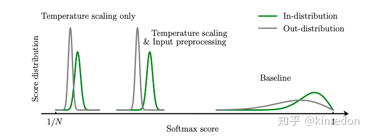

最近看了一些**Out of Distribution(OOD) detection**方面的论文，本文旨在介绍在深度学习背景下的 OOD detection 的相关方法，为之后查阅予以方便，也欢迎有兴趣的人一块交流。

OOD detection 指的是模型能够检测出 OOD 样本，而 OOD 样本是相对于 In Distribution(ID) 样本来说的。传统的机器学习方法通常的假设是模型训练和测试的数据是独立同分布的(IID, Independent Identical Distribution)，这里训练和测试的数据都可以说是In Distribution(ID)。在实际应用当中，模型部署上线后得到的数据往往不能被完全控制的，也就是说模型接收的数据有可能是 OOD 样本，也可以叫异常样本(outlier, abnormal)。如今的深度模型常常会对一个 OOD 样本认为是ID样本中的某一个类，并给出高的置信度，这显然是不合理的。如何让模型识别出 OOD 样本对 AI 的发展有很重要的意义，特别是 AI 安全。

基于深度模型的 OOD detection 首先由 Hendrycks 等人在 17 年提出了一个baseline。其实在这之前，这样的问题在传统机器学习中也得到了广泛的研究，叫做 Outlier Detection, Novelty Detection 。这些术语名称虽然不一样，但其研究的核心都是如何找出 OOD 样本，但它们的 setting 可能有些不一样。比如 OOD detection 通常是在模型任务上修改，要求不仅能够有效的检测出 OOD 样本，而且要保证模型的performance不受影响。然而Outlier Detection, Novelty Detection 可能仅仅只关注检测出 OOD 样本，相当于将模型本身的任务与 OOD Detection分隔开来。关于 Novelty Detection 更多的细节可以看 [A review of novelty detection](https://www.sciencedirect.com/science/article/abs/pii/S016516841300515X)。

这篇文章主要介绍基于深度模型的 OOD Detection 的一些方法，我把近期看的一些 OOD Detection 的方法大致分为Softmax-based, Uncertainty, Generative model, Classifier四个类(应该有别的类别，之后再补充)。
- Softmax-based: 这类方法利用 pre-trained model 输出的最大 softmax 概率进行统计分析，统计发现 OOD 样本和 ID 样本 softmax 概率的分布情况，试图将二者的分布差距加大，然后选取合适的阈值来判断一个样本属于 OOD 还是 ID。这类方法简单且有效，不用修改分类模型的结构，也不需要训练一个 OOD 样本分类器。
- Uncertainty: 由于模型的概率输出并不能直接表示模型的置信度(confidence)。因此这类方法让模型学习一个对输入样本的不确定性属性。面对测试数据，如果模型输入为 ID 样本，则不确定性低，相反，如果模型输入为 OOD 样本，则不确定性高。这类方法需要修改模型的网络结构来学习不确定性属性。
- Generative Model: 这类方法主要利用 Variational Autoencoder 的 reconstruction error 或者其他度量方式来判断一个样本是否属于 ID 或 OOD 样本。主要的假设是，Autoencoder 的隐含空间(latent space) 能够学习出 ID 数据的明显特征(silent vector)，而对于 OOD 样本则不行，因此OOD样本会产生较高的 reconstruction error. 这类方法只关注 OOD 检测性能，不关注 ID 数据本来的任务。
- Classifier: 这类方法比较直接，使用分类器对提取的特征进行分类来判断是否为OOD样本。这类方法简单直接，也取得了不错的效果，有的方法修改网络结构为一个 类分类器， 为原本分类任务的类别数，第 类则是 OOD 类；有的方法直接取提取特征来进行分类，不需要修改网络的结构。
- 
# Softmax-based 方法

## SMOOD

首先介绍的是基于深度模型的 OOD Detection 的第一篇工作[1]，简写为SMOOD(SoftMax OOD)：

A baseline for detecting misclassified and out-of-distribution examples in neural networks:https://arxiv.org/abs/1610.02136

该篇工作提出了一个基于深度模型的 OOD Detection baseline，后续的很多工作都是由此展开。主要的 insight 是：
1. 相比于错误分类的样本和 OOD 样本，分类正确的样本会得到更大的 maximum softmax 概率。
2. 模型会给错误分类的样本和 OOD 样本给予高的 maximum softmax 概率，模型的输出概率不能直接代表模型的置信度(confidence)。

其主要贡献在于：
- 作者通过统计模型预测样本的softmax概率便可以有效的检测出 OOD 样本。
- 指定了标准的 OOD Detection 任务和对于的评估度量标准。
- 提出一个新的方法：评估神经网络输入的重构样本的质量来判断一个样本是否是异常的，进一步提高了baseline.

   
SMOOD的统计结果
 

上图是 SMOOD 方法的统计结果，AUROC(Area Under ROC), AUPR(Area Under Precision and Recall)是threshold无关的性能评价指标，会在后面详细介绍。如果忘记 ROC 和 PR 曲线的意义，可以参考:https://zhuanlan.zhihu.com/p/78182116

这里关注的重点是可以看出模型对 OOD 样本给出了非常高的softmax 概率(col, Pred. Prob(mean)), 说明我们**不能简单依靠模型输出的softmax 概率来判断我们对模型的信心**。通过这些统计数据，我们可以选择一个OOD Detection error 最小 threshold 便可以有效的检测出 OOD 样本。

   
异常检测模块
 

由于[2]中显示辅助的decoder能够有效的提升分类性能，作者设计了一个异常检测模块来进一步提高OOD detection baseline的性能。如上图所示，紫色部分使用 ID 数据训练，紫色上半部分是普通的分类，下半部分是一个 decoder， 能够重构输入，重构的输入与原有的输入相减并使用 element-wise 的平方值。 红色部分是 OOD detection 模块，接受三个输入：神经网络提取的特征，重构的输入处理结果和 softmax 概率，最终使用一个拥有sigmoid函数的单个神经元来预测 OOD 样本的概率，在训练OOD detection 模块时，固定紫色部分。

## ODIN
Enhancing The Reliability of Out-of-distribution Image Detection in Neural Networks:https://arxiv.org/abs/1706.02690

基于 SMOOD, ODIN[3] 提出使用 Temperature Scaling 和 Input Processing 来提升模型 OOD detection 能力。SMOOD证明了模型对正常分类的样本和 OOD 样本的 softmax 预测概率分布有差别，通过选择合适的threshold便可以有效的区分 ID 和 OOD 样本，然而实际上，这样的操作有效但效果有限(所以只是baseline）。ODIN 的想法很简单，既然模型对ID 和 OOD 样本输出的 softmax 预测概率分布不同，那么可不可以让它们分布差异变得更大呢？这样便可以更容易的检测 OOD 样本，答案显然是可行的。

   
Temperature Scaling 和 Input Preprocessing对原有softmax概率分布的影响
 

如上图所示，相比于 baseline, 使用 Temperature scaling 和 Input Preprocessing 能有效地使得 ID 和 OOD 样本 softmax 分布概率差异变大。
Temperature Scaling

Softmax 的Temperature Scaling 其实在很多地方都有应用，如Hinton的 Knowledge Distillation[4], 使用一个足够大的 值，可以使得 softmax 的分数靠近 ，作者也用数学方法证明了这能够有效的分离 ID 和 OOD 样本的 softmax 分布。

- Input Preprocessing

$$p_{i}(\boldsymbol{x} ; T)=\frac{\exp \left(f_{i}(\boldsymbol{x}) / T\right)}{\sum_{j=1}^{N} \exp \left(f_{j}(\boldsymbol{x}) / T\right)}$$

该方法受[5]启发， 为输入的样本，最后得到的概率值对输入数据求梯度，通过这样的操作可以使得得到的 靠近它真实的类别，对应类别的 softmax 预测概率增加，这样所有的 ID 样本将更加靠近其真实的类别，进一步分离 ID 和 OOD 样本 softmax 的概率分布。

- Uncertainty

$$\tilde{\boldsymbol{x}}=\boldsymbol{x}-\varepsilon \operatorname{sign}\left(-\nabla_{\boldsymbol{x}} \log p_{\hat{y}}(\boldsymbol{x} ; T)\right)$$

世界上有很多问题是有确切的答案，比如6乘9等于多少？也有很多问题是没有确切的答案，比如人的一生能走多远？所以对于已有的问题，我们对答案都有一个不确定性，对于已知有解的问题，置信度为1，对于未知的问题，根据信息量的多少，置信度的大小也会发生变化。基于不确定性的OOD detection 方法就是使用模型的置信度来衡量一个样本属于 ID 还是 OOD 样本。

   
根据置信度 ID 和 OOD 样本统计分布[6]

## [Learning Confidence for OOD Detection[6]](https://arxiv.org/abs/1802.04865)

考虑我们参加平时考试的场景，假设对于一些不确定的问题，我们可以请求得到提示。在这个过程中，对于确定性的问题，我们可能不需要任何提示(hints)。但如果我们遇到不确定的问题，我们需要提示才能得到正确的答案。在考试结束后，可以通过计数一个人请求提示的次数来近似估计对自己成绩的信息。那么如何建模这样的场景用于 OOD detection 呢？

  
网络结构图[6]

网络结构图[6]

在原有的分类外再添加一个分支：置信度分支来预测一个置信度 ，即：

$$p, c=f(x, \Theta) \quad p_{i}, c \in[0,1], \sum_{i=1}^{M} p_{i}=1$$

为了在训练时，给网络一些提示(hints)，使用置信度 来调整 softmax 预测概率(如上图右边部分所示)：

$$p_{i}^{\prime}=c \cdot p_{i}+(1-c) y_{i}$$

分类 loss 为：

$$\mathcal{L}_{t}=-\sum_{i=1}^{M} \log \left(p_{i}^{\prime}\right) y_{i}$$

为了阻止网络最小化分类 loss 时总是选择 ，添加一个对数惩罚项，即置信度loss，使用二分类的交叉上熵loss，置信度总设为1，表示网络总是非常自信的：

$$\mathcal{L}_{c}=-\log (c)$$

总的loss为：

$$\mathcal{L}=\mathcal{L}_{t}+\lambda \mathcal{L}_{c}$$

通过训练，模型会不断提升分类性能，同时可以根据置信度 来衡量输入的数据是否为 ID 样本。

## [Multiple Semantic Label Representations[7]](https://arxiv.org/abs/1808.06664)

  
Multiple Semantic Label Representations Framework[7]

作者借助通信原理当中的理论：鲁棒性可以通过添加传输编码不同级别的冗余(redundancy)来实现[8]。换到神经网络中，不像以前直接使用一个稀疏的 one-hot vector 作为监督信息，而是使用不同密集监督信息。通过使用不同的语言模型来编码target label 得到不同的word embedding，进而利用这些 word embedding来训练多个回归函数。

那问题出现了，就算这能有效的提升模型的分类性能，跟 OOD detection 有什么关系呢？实际上是有关系的，在 [9] 的 section 4中得出一个结论，表征(representations)的范数的大小与模型预测的置信度是成正比的，因此可以用学习到的 target label 表征的范数来判断样本是否属于OOD样本，如果学习到的表征的 范数小于阈值 , 则认定其为 OOD 样本。

具体来说，在训练时，将预测表征(representations)和target label的word embedding用来计算余弦距离：

$$d_{\cos }(\mathbf{u}, \mathbf{v})=\frac{1}{2}\left(1-\frac{\mathbf{u} \cdot \mathbf{v}}{\|\mathbf{u}\|\|\mathbf{v}\|}\right)$$

即loss为：

$$\bar{\ell}(\mathbf{x}, y ; \theta)=\sum_{k=1}^{K} d_{\cos }\left(\mathbf{e}^{k}(y), \boldsymbol{f}_{\theta^{k}}^{k}(\mathbf{x})\right) $$

其中$\boldsymbol{f}_{\theta^{k}}^{k}(\mathbf{x})$为第$k$个分支的预测表征，$\mathrm{e}^{k}(y)$为对应target label 的word embedding.

在推断时，使用软决策(soft decision)，即选择与$K$个表征距离和最小的target label作为预测结果：
$$\hat{y}=\underset{y \in \mathcal{Y}}{\arg \min } \sum_{k=1}^{K} d_{\cos }\left(\mathbf{e}^{k}(y), \boldsymbol{f}_{\theta^{k}}^{k}(\mathbf{x})\right)$$
通过学习得到的表征$\boldsymbol{f}_{\theta^{k}}^{k}(\mathbf{x})$的$L2$范数作为检测 OOD 样本的分数，即：
$$\sum_{k=1}^{K}\left\|\boldsymbol{f}_{\theta^{k}}^{k}(\mathbf{x})\right\|_{2}^{2}<\alpha$$
如果得到的分数小于 则为 OOD 样本。

## Generative model

生成模型通过利用 Variational Autoencoder 的 reconstruction error 来检测 OOD 样本，因为decoder 能够有效的解码出 ID 样本，进而生成与 Input 相对应的重构数据，而OOD样本则不行。

Improving reconstruction autoencoder out-of-distribution detection with mahalanobis distance[10]:https://arxiv.org/abs/1812.02765

基于 VAE 重构的方法很难捕获到一些特定的异常样本，这些样本在隐含空间(latent space)中与已知的样本距离很远，但距离隐含的流形(manifold)很近。如上图所示，分别是线性流形和非线性流形的例子。

解决这样问题的简单的解决方法是增加隐含空间的维度以此来捕获原有数据的更多的变化。但这样会慢慢使得模型失去辨别 ID 和 OOD 样本的能力，因为隐含空间维度足够大时，理论上可以重构任何输入。

作者使用马氏距离来衡量一个样本 与 ID 训练数据在流形空间的距离：

$$D_{M}(x)=\sqrt{(x-\hat{\mu})^{T} \hat{\Sigma}^{-1}(x-\hat{\mu})}$$

，这里$\hat{\mu}$和$\hat{\mathbf{\Sigma}}$是多元高斯分布的均值和协方差矩阵。马氏距离是尺度不变并且能考虑不同维度之间的关系。更多关于马氏距离：https://zhuanlan.zhihu.com/p/46626607

最后使用Reconstruction error和马氏距离一起来检测 OOD 样本:

$$\text {novelty}(x)=\alpha \cdot D_{M}(E(x))+\beta \cdot \ell(x, D(E(x)))$$

Generative model 方法除了基于reconstruction和distance的方法，还有一类方法是通过生成一些样本，让这些样本包围整个 ID 数据的流形，然后训练一个分类器来区分这些样本和 ID 样本，这样能学出一个分界线尽量包裹 ID 数据流形，通过这个分解线来检测 OOD 样本。感兴趣可以看[11].

## Classifier

这类方法很容易理解，就是对网络提取的特征进行分类来检测 OOD 样本。这里介绍最近出现的最新文章，目前还挂在arXiv上。

## OOD discernment layer (OODL)[12]

与之前的分类倒数第二层的特征方法不同，作者认为倒数第二层的特征可能不是总容易分离ID样本和OOD样本，而可能存在隐含的 Early-Layer Output能够被有效地分离。

 

如上图所示，通过比较(a)与(c)，(b)与(d)，可以发现通过选择特定地容易区分的层输出的特征能够非常容易的区分。基于此，作者提取不同层的输入输出数据，使用一个一类的SVM分类器，并统计该层的分类错误率，然后选择错误最小的层来检测 OOD 样本。具体算法步骤如下图所示：

 

# 实验部分

## Metric
- FPR at 95% TPR：当真阳率(True Positive Rate, TPR)是 95%时，假阳率(False Positive Rate, FPR)的概率(OOD样本被错分为ID样本). 这里$TPR = TP/(TP + FN)$,$FPR = FP/(FP + TN)$.
- Detection error：当真阳率(True Positive Rate, TPR)是 95%时错误分类的概率。
- AUROC(Area Under the Receiver Operating Characteristic Curve)：可以解释为“正样本的概率大于负样本的概率”，最大值为100%.
- AUPR(Area under the Precision-Recall curve)：PR图于坐标轴围成的面积，最大值为100%. P为 Precision, R 为 Recall. AUPR的值会受正样本的数量影响，以此，通常会把 ID样本作为正样本，OOD作为负样本，记为AUPR-In. 反之，会把 ID样本作为负样本，OOD作为正样本，记为AUPR-out.
## 实验结果

 
实验结果

数据集一般会选择MNIST, cifar-10或者cifar-100作为 ID 样本。OOD样本选择很广，不同的论文可能选择都有些差异，具体可以参照对应的论文。

## 总结

随着深度学习的崛起，很多的任务的性能都有一个新的突破，基于深度模型的 OOD detection 对 AI 的发展有很重要的意义，特别是AI 安全领域。在实际应用，部署的模型如何提前辨别输入的数据是OOD样本可以大大的减少模型的错误率，而且OOD样本可能会对实际应用造成不可估计的损失。本文介绍了一些基于深度模型的OOD detection方法，希望读者通过阅读这篇文章，能这类方法有一定的了解，如果能激起你的研究兴趣，再好不过了：）

Reference

[1] Hendrycks D, Gimpel K. A baseline for detecting misclassified and out-of-distribution examples in neural networks[J]. arXiv preprint arXiv:1610.02136, 2016.

[2] Yuting Zhang, Kibok Lee, and Honglak Lee. Augmenting supervised neural networks with unsupervised objectives for large-scale image classification. In International Conference on Machine Learning (ICML), 2016.

[3] Liang, S., Li, Y., & Srikant, R. (2017). Principled detection of out-of-distribution examples in neural networks. arXiv preprint arXiv:1706.02690.

[4] Hinton, G., Vinyals, O., & Dean, J. (2015). Distilling the knowledge in a neural network. arXiv preprint arXiv:1503.02531.

[5] Goodfellow, I. J., Shlens, J., & Szegedy, C. (2014). Explaining and harnessing adversarial examples. arXiv preprint arXiv:1412.6572.

[6] DeVries, T., & Taylor, G. W. (2018). Learning confidence for out-of-distribution detection in neural networks. arXiv preprint arXiv:1802.04865.

[7] Shalev, G., Adi, Y., & Keshet, J. (2018). Out-of-distribution detection using multiple semantic label representations. In Advances in Neural Information Processing Systems (pp. 7375-7385).

[8] Amos Lapidoth. A foundation in digital communication. Cambridge University Press, 2017.

[9] Taigman, Y., Yang, M., Ranzato, M. A., & Wolf, L. (2015). Web-scale training for face identification. In Proceedings of the IEEE conference on computer vision and pattern recognition (pp. 2746-2754).

[10] Denouden, T., Salay, R., Czarnecki, K., Abdelzad, V., Phan, B., & Vernekar, S. (2018). Improving reconstruction autoencoder out-of-distribution detection with mahalanobis distance. arXiv preprint arXiv:1812.02765.

[11] Vernekar, S., Gaurav, A., Abdelzad, V., Denouden, T., Salay, R., & Czarnecki, K. (2019). Out-of-distribution Detection in Classifiers via Generation.arXiv preprint arXiv:1910.04241.

[12] Abdelzad, V., Czarnecki, K., Salay, R., Denounden, T., Vernekar, S., & Phan, B. (2019). Detecting Out-of-Distribution Inputs in Deep Neural Networks Using an Early-Layer Output. arXiv preprint arXiv:1910.10307.