[toc]

视觉目标跟踪（Visual Object Tracking）是计算机视觉领域的一个重要问题.尽管近年来受到了广泛研究,目标跟踪问题由于本身的高难度、高质量数据的稀少,研究热度比目标检测、语义分割等基本视觉任务略低一些.深度学习的发展和计算机算力的增强带来了视觉算法性能的突飞猛进,而目标跟踪领域中基于深度神经网络的方法只在近几年才初见端倪,可谓大有可为.

如果你对视觉目标追踪有所兴趣或者是这一领域的入门新手,本文将帮助你对视觉目标追踪问题和经典方法有一个初步的了解.如果你是已经有了一定相关知识储备的研究者,也欢迎探讨、指教.

# 单目标跟踪
## 起源——相关滤波与目标跟踪(公式需要整理)

给你一张我的正脸照（没有经过美颜处理的）,你该如何在人群中找到我呢？一种最直观的方案就是:“谁长得最像就是谁”.但是对于计算机来说,如何衡量“长得像”,并不是个简单的问题.这就涉及一种基本的运算——互相关（cross-correlation）.互相关运算可以用来度量两个信号之间的相似性.在离散的图像空间中,它的数学定义是这样的:

$$(f\star h)[i,j]=\sum_{u=-k}^{k}{\sum_{v=-k}^{k}{h[u,v]f[i+u,j+v]}}$$

h 和 f 分别为核和图像,代表着我们要搜索的目标模版和存在要搜索的目标的图像.如果这个公式对你来说有点难以理解,那你又能否记起离散图像空间卷积运算的定义:

$$(f * h)[i,j]=\sum_{u=-k}^{k}{\sum_{v=-k}^{k}{h[u,v]f[i-u,j-v]}}$$

哦~从公式看,它俩不就是把 h 水平、垂直分别翻转一下的关系嘛！实际上,在很多机器学习库的实现中,所谓的“卷积”就是通过互相关运算来实现的——反正卷积核中的所有参数都是通过优化得到的、物理意义不明的值,它要做的仅仅是“在卷积核合适的位置学习合适的值”.严格使用卷积运算学习得到的核,等价于使用互相关运算学习到的核的180度翻转.非要去纠结这二者的不同,也就意义不大了.

话说回来,互相关运算让我们得以衡量 h 与 f 的相似度,换句话说,互相关得到的响应图中每个像素的响应高低代表着每个位置相似度的高低.假设目标存在于新一帧图像 f 中的话,那么在 h 和 f 对得最齐的地方就应该是目标中心的位置了！

但是紧接着,这样的思路就又会出现一些难点:目标的形状、大小甚至身处的环境都是在不断发生变化的.在考虑这些变数的同时,如何学习目标不变的那些特性,从而准确地进行定位呢？或者说,如何让核 h 能够通过与 f 的互相关运算来最有效地得到响应呢？这也就是单目标跟踪主流方法所尝试的思路.用更数学一点的定义来讲,就是:

$$arg\min_{h}\sum_{i}|f_i*h-g_i|$$

$g_i$的定义则是响应图的ground truth.因为我们处理的是一个连续的图像序列,所以还存在下标 i 通过对上式中的 h 对整个图像序列进行优化,我们可以让目标跟踪算法学习一个最优的相关滤波器.为了提升优化的速度,我们还可以把 h 和 f 投射到傅里叶频域.空域中的互相关运算在频域中变成了逐项相乘,优化目标也就变成了:

$$arg\min_{H^*}\sum_{i}|F_i\odot H^*-G_i|$$

它等价于:

$$arg\min_{H^*}\sum_{i}|F_i\odot H^*-G_i|^2$$

那么对于整个序列而言,我们可以解出最优的$H^*$:

$$H^*=\frac{\sum_{i}G_i\odot F_i^*}{\sum_{i}F_i\odot F_i^*}$$

但这并不一定对于每一帧图像都是最优的.为了让$H^*$随着序列的进行而适应性地进行更新,我们可以递归式地定义不断更新中的$H^*$:

$$H_i^*=\frac{A_i}{B_i}\\ A_i=\eta G_i\odot F_i^*+(1-\eta)A_{i-1}\\B_i=\eta F_i\odot F_i^*+(1-\eta)B_{i-1}$$

通过调整更新学习率参数$\eta$,我们可以让算法学得具有高鲁棒性并且能够快速适应目标外观变化的$H^*$.上述的过程就是首次在单目标跟踪问题上使用相关滤波的工作——MOSSE[1]（Minimum Output Sum of Squared Error, CVPR10, F. Henriques et al.）的基本思路.

## 发展——日渐完善的CF模型

一转眼,距离MOSSE被提出已经是九年多的光景.如今的单目标视觉跟踪已经发展到了怎样的状态了呢？请看下图:

  
Recent developments on visual trackers

在这个大树中,MOSSE成为了CF（Correlation Filter,即相关滤波）目标追踪算法的鼻祖.在MOSSE之后,各种基于相关滤波思路的目标追踪方法蓬勃发展、日渐繁荣,而它们的目标追踪算法基本框架如下图所示.

 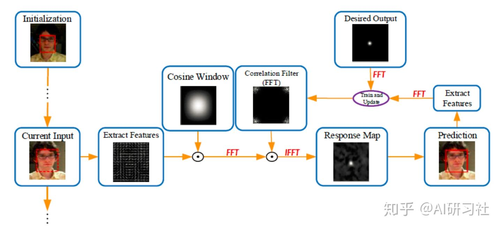 
基于相关滤波的目标追踪基本框架

尽管大体框架相同,当年的MOSSE在各种卷积神经网络层出不穷的今天看来已经非常落后了——你能想象MOSSE甚至没有使用手工特征,而是直接使用像素灰度值进行运算的吗？现在的相关滤波跟踪算法一般需要用到CN（Color Names）、HOG（Histogram of Oreinted Gradients）等手工特征以及用CNN提取的特征进行结合从而用于滤波器的学习.

那么,让我们就来简要回顾一下由MOSSE衍生而来的一些相关滤波追踪的经典工作:

### KCF

KCF[2]（Kernelized Correlation Filter, TPAMI15, F. Henriques et al.）使用循环移位得到的循环矩阵来采集正负样本,利用循环矩阵在傅里叶空间可对角化的性质,将矩阵的运算转化为元素的点乘,从而降低了运算量,使得算法满足实时性要求.同时,KCF使用多通道HOG特征代替单通道灰度特征,将特征扩展到多通道的非线性特征空间,达到了更高的鲁棒性.KCF的优化方式为加入了正则项的岭回归:

$$arg\min_{w}\sum_i (f(x_i)-y_i)^2+\lambda ||w||^2 $$

 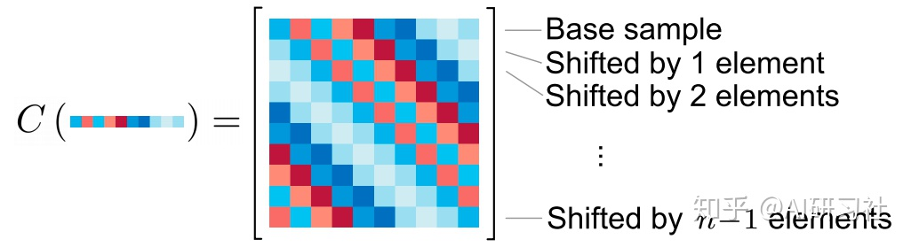 
循环矩阵(https://arxiv.org/pdf/1404.7584.pdf))

### DSST

DSST[3]（Discriminative Scale Space Tracking, BMVC14, M. Danelljan et al.）将关注点更多地放在物体的尺度估计上,将目标的中心平移和目标的尺度变化视作两个独立的问题,在使用HOG特征训练平移相关的CF之外,还使用MOSSE训练了另一个尺度相关的滤波器,用于预测目标尺度的变化.DSST在跟踪的精度和成功率上都有很大提升,只不过速度相对KCF等慢了一些.

### SRDCF & DeepSRDCF

SRDCF[4]（Spatially Regularized Discriminative Correlation Filter, ICCV15, M. Danelljan et al.）在KCF优化目标的基础上加入了空域正则化,增强了模型的判别能力,优化目标变为:

$$arg\min_{w}\sum_i (f(x_i)-y_i)^2+\lambda ||\tilde{w} \odot w||^2 $$

为了与KCF进行对比,这里使用了与SRDCF原文不同的符号表示.式中的 $\tilde{w}$ 与 $w$ 意义并不相同,它是对 $w$ 施加的空间正则化权重.也就是说,某些位置（主要是边界）的滤波器系数会受到惩罚.

 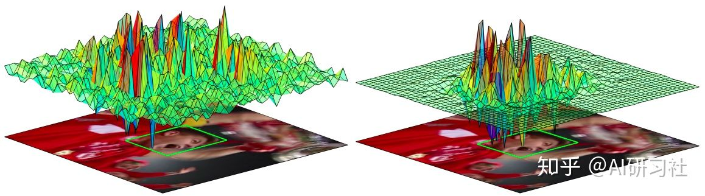 
一般DCF（左）与SRDCF（右）的效果对比)

将CN/HOG特征换为深度CNN特征后,Danelljan大神做了大量实验进行对比,发现使用CNN浅层特征明显比HOG那些手工特征效果好.于是把自己ICCV15的SRDCF模型改一改顺手又发（水）了一篇ICCV15 Workshop……也就是DeepSRDCF[5].

 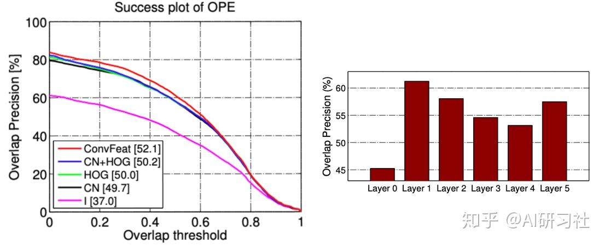 
不同类型特征的效果对比以及使用CNN不同层的效果对比

### C-COT

C-COT[6]（Continuous Convolution Operator Tracker,ECCV16, M. Danelljan et al.）使用一种隐式的插值方式将模型的学习投射到一个连续的空间域中,提出了一种在连续空间域上的卷积算子.C-COT将多种分辨率的深度特征进行了高效的集成,使得模型在各个数据集上的性能都得到了很大的提升.

 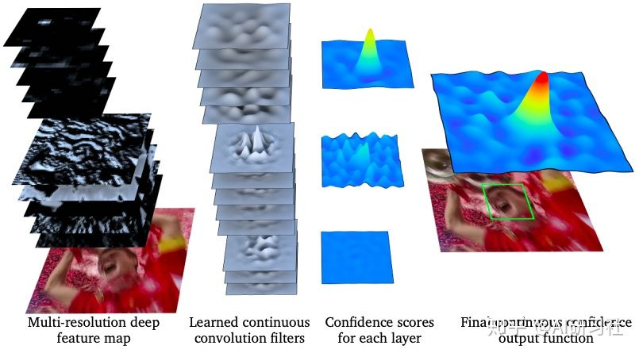 
C-COT的特征图、卷积核、各层置信图和融合后连续空间的输出置信图

### ECO
ECO[7]（Efficient Convolution Operators, CVPR17, How old is M. Danelljan et al.?）则是在C-COT上的进一步提升.首先ECO降低了C-COT的参数量,对特征提取作了降维简化,提升效率、防止过拟合；第二,使用高斯混合模型生成不同样本组合,简化训练集的同时还增加了多样性；另外,提出了一种高效的模型更新策略,在提升速度的同时还提升了鲁棒性.

 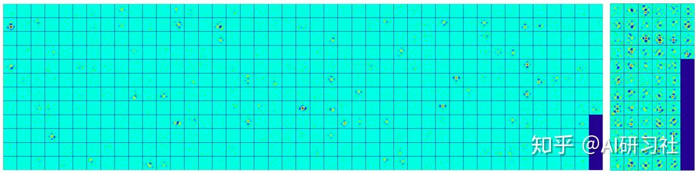 
C-COT学习后的卷积核与ECO学习后的卷积核

## 现状——孪生网络风生水起
### SiamFC
目标跟踪领域内,与C-COT同时中了ECCV16的还有一篇称作《Fully-Convolutional Siamese Networks for Object Tracking》[8]的文章,也就是SiameseFC（或SiamFC）——全卷积孪生网络（L. Bertinetto et al.）.SiamFC虽然不是第一个在目标跟踪领域使用孪生网络的（据笔者所知,第一个使用孪生网络解决目标跟踪问题的是SINT[9]（Siamese Instance Search for Tracking, CVPR16, R. Tao et al.））,但它可以说是开创了端到端深度学习式相关滤波方法的先河,也为深度学习方法逐渐超越相关滤波方法拉开了序幕.
说了这么多,这个“全卷积孪生网络”究竟是怎么个样子呢？请看下图:

 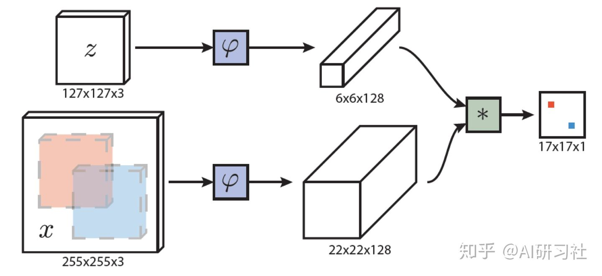 
SiameseFC

（好图呀！不仅画得令人赏心悦目,还很清楚地传达了孪生网络的基本思想）图中的 φ 就是CNN编码器,上下两个分支使用的CNN不仅结构相同,参数也是完全共享的（说白了就是同一个网络,并不存在孪生兄弟那样的设定）.z 和 x 分别是要跟踪的目标模版图像（尺寸为127x127）和新的一帧中的搜索范围（尺寸为255x255）.二者经过同样的编码器后得到各自的特征图,对二者进行互相关运算后则会同样得到一个响应图（尺寸为17x17）,其每一个像素的值对应了 x 中与 z 等大的一个对应区域出现跟踪目标的概率.

SiamFC的离线端到端训练使得CNN模型学习了衡量 x 与 z 的相似性的方式,同时由于很好地利用了GPU的算力,使用AlexNet的SiamFC可以达到65FPS的速度,并保持了不错的准确率,尽管跟踪效果还无法匹敌当时的state-of-the-art水平.

在上一步分的树状图中,SiamFC俨然成为Deep Learning分支的最大子分支的根节点.读者可能会问:问什么前边说到的ECO等等也用了CNN,却不在Deep Learning分支下呢？众所周知,深度学习强调一种“end-to-end”的思想,尽可能地让一个模型去学习从原始输入到最终输出之间的一个完整映射、去寻找一个全局的最优解.只有以这种方式处理跟踪问题的方案才被归入树状图的Deep Learning分支下.左右两大分支（DL和CF）并非对立关系,DL分支下的很多工作（以SiamFC、SiamRPN为代表）都采取了相关滤波的思路,CF分支下的很多工作也使用了CNN作为特征提取器.

### SiamRPN & DaSiamRPN

就像DSST之前的众多相关滤波跟踪算法一样,SiamFC难以应对物体尺度的变化.SiamRPN[10]（CVPR18, B. Li et al.）则借鉴了目标检测领域常用的RPN（Region Proposal Network,区域生成网络）用于预测新图像中目标的尺度.

SiamRPN在 x 和 z 经过孪生CNN得到各自的特征图后,没有直接对二者进行互相关运算,而是将这两个特征图各自放入RPN部分的两个分支中,每个分支中的两个特征图分别经过一个CNN再进行互相关运算.RPN部分的两个分支分别用于进行目标概率的预测和目标边框的回归,并且同样借鉴了目标检测领域的anchor方法,从而降低了目标边框回归的训练难度.

 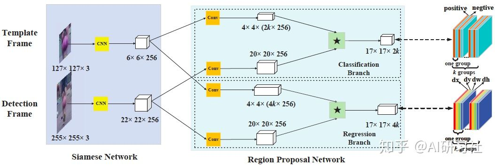 
SiamRPN

SiamRPN之后,作者又紧接着提出了改进版——DaSiamRPN[11]（ECCV18, Z. Zhu et al.）,对训练数据进行了增强以提升模型对同类别物体干扰的判别能力（一般的模型往往着重于前景与背景的判别,而对相似物体的判别性较差）.另外,DaSiamRPN加入了增量学习的Distractor-aware模块,在运行时采样并更新模型的参数.使得模型能更好的迁移到当前视频的域中.

DaSiamRPN在VOT实验上的性能超越了ECO,同时还能跑到160FPS以上的速度.深度学习单目标跟踪方法可以说得上是“风生水起”.

## 困难——卷积层层困难重重
### 问题
DaSiamRPN在ECCV上发表已经是2018年的事情了.这时候,各种花样的深度CNN早已屡见不鲜,在深度上更是有几十层到上百层——然而,DaSiamRPN还在使用只有5层无padding的AlexNet.是不是可以尝试一下把网络主干换成比较深的残差网络来进一步提高跟踪性能（然后水一篇论文）呢？

笔者还真试了……

不知各位读者有没有留意SiamFC和SiamRPN中各个特征图的尺寸？在SiamFC中,原尺寸127x127的 z 经过了5层AlexNet后得到的特征图已经小到6x6的尺寸,因为没有padding并且经过了几次池化.照这样下去,再加一个池化层和一个3x3卷积层,特征图就要变成1x1了.显然,想让网络再深一些,padding是不可避免的.

加了padding,网络的确能够变得很深了（比如说我直接上了YOLOv3的DarkNet-53,甚至还加了特征金字塔）,但是新的风暴又出现了——CNN的平移不变性变得极差,目标的定位经常往往出现明显的偏移,模型的对目标的判别能力也不如原版的SiamRPN.满怀信心做实现的笔者看到这样的结果已经准备退学了……

幸运的是,正值此时,笔者偶然观看了一场[CVPR19论文分享会的在线直播](https://www.yanxishe.com/meeting/44),发现原来学界的大佬们也在研究如何把更深的CNN用在目标跟踪上.下面两个登场的工作,分别以不同的方式应对了深度残差网络在目标跟踪问题上的困难.

### 方案

#### CIR (SiamDW)
SiamDW[12]的作者认为,较深的卷积神经网络的感受域过大,这降低了特征的判别性和定位的准确性.另外,多层的padding使得孪生网络的学习产生偏移.作者对网络主干的各种性质（padding,stride,感受域大小等）进行了系统性的研究分析,并得出了以下结论:1)孪生网络跟踪器倾向于更小的stride；2)感受域大小应取决于目标模板图像 z 的大小,一般60%到80%最佳；3)stride、感受域大小和输出响应图大小互相有很强的依赖,应当共同考虑；4)全卷积的孪生网络应当尽可能消除 x 和 z 在感知上的不一致性.

针对上述结论,作者提出了CIR（Cropping-Inside-Residial）模块以取代ResNet中的基本模块,基本做法就是下图中每个块的addition之后的crop操作,除去受padding影响的边缘部位.使用CIResNet-22作为主干的改进版SiamFC和SiamRPN都有了不小的性能提升,只是似乎这样的做法依然无法让网络变得很深？

 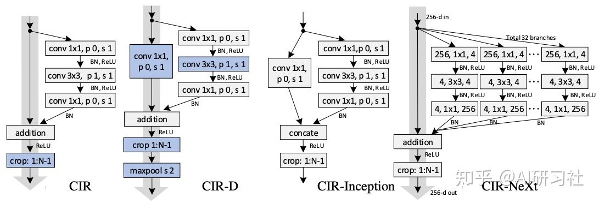 
各种CIR block

#### SiamRPN++
SiamRPN++[13]是SiamRPN的作者在其基础上的改进.主要改进有以下四点:1)使用了微调版的ResNet-50主干,极大地优化了特征的提取；2)对ResNet-50的3、4、5阶段的特征分别使用RPN进行边框回归与目标定位,并使用带权重的融合方法结合三者的结果；3)使用了depth-wise互相关运算,减少参数量,加速了RPN部分的运算；4)最重要地,提出了一种spatial-aware的采样策略,从而打破了目标跟踪对CNN的严格平移不变性限制.

作者分析认为,只有无padding的网络才具有严格的平移不变性,而加深CNN又无法避免padding的出现.但是通过在训练样本中人工加入服从均匀分布的随机平移可一定程度上打破这种严格平移不变性限制.从模型的预测结果上来看,如果训练数据在一定范围内服从均匀分布,那么理想情况下跟踪器预测的结果也应该更接近均匀分布.作者通过定量实验发现,加入像素范围为32的随机平移后,最终得到的目标位置热图更接近均匀分布,说明预测的结果更接近实际测试目标的分布情况.

 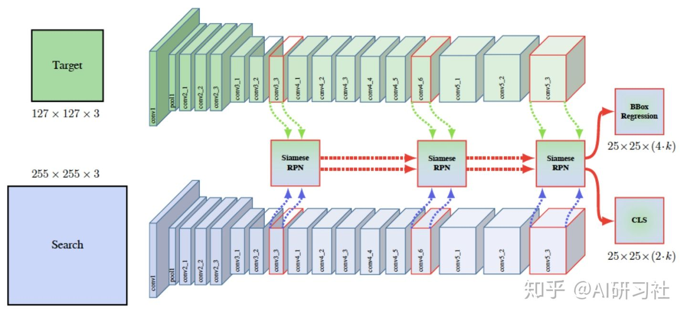 
SiamRPN++

加入了以上几点改进的SiamRPN++成为了OTB2015、VOT2018、UAV123、LaSOT和TrackingNet上的第一名,基于深度学习的方法终于在跟踪准确度上领先一步了.

PS:从这几年顶会的VOT论文数量看,基于深度学习方法也确实领先一步了……

PPS:除了上述的方法之外,基于深度学习的目标跟踪还有不少值得一提的文章,如MDNet[14],TCNN[15],SANet[16],CREST[17],VITAL[18]等等,恕不能一一介绍.

PPPS:以上的相关滤波方法中大部分工作都包含相当复杂的数学推导,而本文没有过多涉及,一来本人能力有限,二来篇幅也不宜过长.对其推导有兴趣的同学请参考原文.

# 多目标跟踪
## 问题定义
与单目标跟踪相比,多目标跟踪的研究进展则缓慢得多,可用的数据集不够丰富,可以参考的开源代码也比较少.因为相对来说实现难度更大,多目标跟踪是一个更工程化的问题,深度学习在该问题上的潜力也尚未被很好地挖掘出来.

一般提到“视觉目标跟踪”或“VOT”,往往指的是单目标跟踪.尽管看起来SOT（Single Object Tracking）和MOT（Multi Object Tracking）只是目标数量上的差异,但它们通用的方法实际上截然不同.从研究对象上讲,单目标跟踪算法一般是不限类别的,而多目标跟踪一般是仅针对特定类别的物体.从时长上讲,单目标跟踪更多地针对短时间的图像序列,而多目标跟踪一般要处理较长的视频,其中涉及各个目标的出现、遮挡和离开等情况.从实现思路上讲,单目标跟踪更关注如何对目标进行重**定位**,而常见的多目标跟踪方法往往更多地关注如何根据已检测到的目标进行**匹配**.

按照初始化方式,常见的多目标跟踪算法一般可分为基于检测的跟踪（Detection-Based Tracking）和无检测的跟踪（Detection-Free Tracking）.DBT要求由一个目标检测器首先将每帧图像中的目标检测出来,而DFT要求已知每个目标首次出现的位置,再对每个目标分别进行跟踪（这一点可以看作是在同一个视频中进行的多个单目标跟踪）.显然,前者的设定更接近实际应用场景,也是学界研究的主流.

 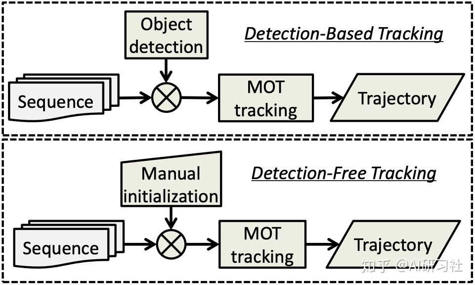 
按照初始化方式分类.上:基于检测的跟踪；下:无检测的跟踪

按照处理方式,多目标跟踪算法又可分为在线跟踪（Online Tracking）和离线跟踪（Offline Tracking）.在线跟踪要求处理每一帧时,决定当前帧的跟踪结果时只能利用当前帧和之前的帧中的信息,也不能根据当前帧的信息来修改之前帧的跟踪结果.离线跟踪则允许利用之后的帧的信息从而获得全局最优解.显然,离线追踪的设定也不太适合实际应用场景,但是以一种“batch”的形式进行的离线跟踪（每次得到若干帧,在这些帧中求全局最优）也是可行的,只是会导致一点延迟.

 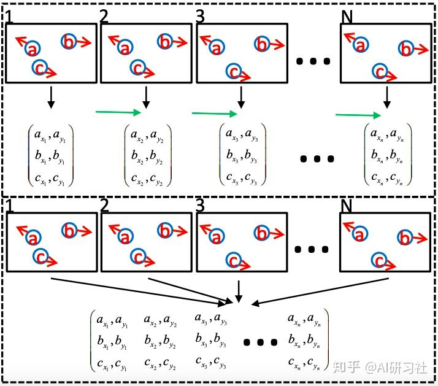 
按照处理方式分类.上:在线跟踪；下:离线跟踪

## 典型方法
以下是多目标跟踪领域一些比较基础但很典型的工作.
### SORT & DeepSORT
SORT[19]（Simple Online and Realtime Tracking, ICIP16, A. Bewley et al.）是主流的Tracking-by-Detection框架（检测-编码-匹配-更新）的一个雏形,后边的很多工作都有类似的框架.SORT有四个基本组件:目标检测器、状态预测、数据关联和track管理——这也是很多遵循Tracking-by-Detection框架的多目标跟踪算法的基本组件.

SORT使用VGG16主干的Faster R-CNN作为目标检测器.对于目标的状态,SORT简单地使用中心坐标、面积、长宽比以及它们的变化率对目标进行建模（如下式）,而没有利用任何外观信息.SORT使用Kalman滤波器主动地对目标之后的状态进行预测,并将预测的结果与实际检测到的目标边框进行匹配.track与detection的关系被视作二分图,二分图的每一条边的权重由它的两个顶点（分别为一个track和一个detection）的IOU定义.SORT使用匈牙利算法在这个二分图中寻找最优匹配,并为匹配设置最小IOU阈值,以减少错误的匹配数量.

$$x=[u,v,s,r,\dot{u},\dot{v},\dot{s}]^T$$

关于track的管理上,SORT将匹配失败的track保留$T_{loss}$帧,为匹配失败的detection开启新的track并设置其初始状态.

DeepSORT[20]（Simple Online and Realtime Tracking with a Deep Association Metric, ICIP17, N. Wojke, et al.)是SORT作者基于SORT的改进版本,其最大的贡献在于使用了深度CNN提取目标的特征以作为匹配标准.DeepSORT使用Mahalanobis距离作为运动特征的相似度标准,以及余弦距离作为外观特征编码的相似度标准,两种相似度通过加权平均来得到总体的相似度.另外,DeepSORT定义了一种级联式的匹配方法,使得近期活跃度较高的track被优先匹配.

尽管DeepSORT已经是2017年的算法了,但似乎MOT16使用公开检测的排行榜上占据首位的依然是DeepSORT的复现版...

### IOU Tracker & V-IOU Tracker

IOU Tracker[21]（AVSS17, E. Bochinski, et al.）的基本思想是:如果帧率足够高、检测效果足够好,前后两帧各个目标边框之间的IoU（Intersection Over Union）即可作为关联的强大依据.在这样的设定下,IOU Tracker不考虑外观信息、不对运动轨迹进行预测、也不使用复杂的匹配算法,直接用贪心的策略为两帧的所有边框之间进行匹配.具体而言,在处理每帧时,对每一个正在跟踪的目标,从检测到的框中取一个与它之前位置之间的IOU最大的一项,若这项IOU大于阈值则认为二者匹配,否则匹配失败.如果某一个tracklet匹配失败,则认为目标离开（是的,甚至不考虑检测器不小心检测失败的可能性）,根据它“存活”的时长和置信度决定是否加入“已完成的track”中.如果存在没有匹配到tracklet的检测框,则认为是新出现的目标并为之创建一个新的tracklet.

 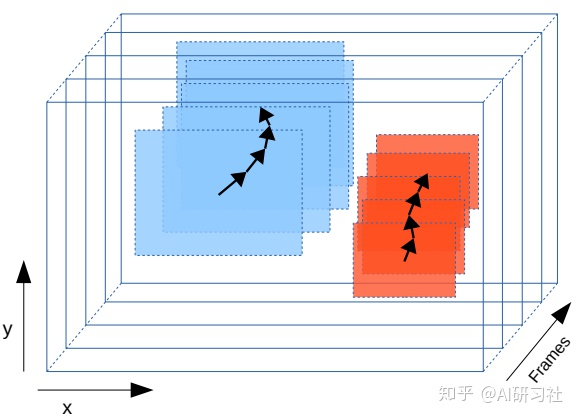 
IOU Tracker

但是！把希望全寄托于目标检测器是不行的.所以作者一年之后又推出了V-IOU Tracker[22]（AVSS18, E. Bochinski, et al.）.一方面,当一个tracklet无法匹配到相应的检测框时,不再简单地认为目标离开了视野,而是在此时启动一个单目标跟踪器来尝试继续跟踪这个目标,直到ttl(Time to Live）时间之后.另一方面,当一个新tracklet被创建时,先启动一个单目标跟踪器尝试在之前的ttl帧中寻找该目标.如果新的tracklet和已完成的track能够通过IOU匹配起来,就将他们合并处理.（如下图中的红色箭头,注意其方向）

 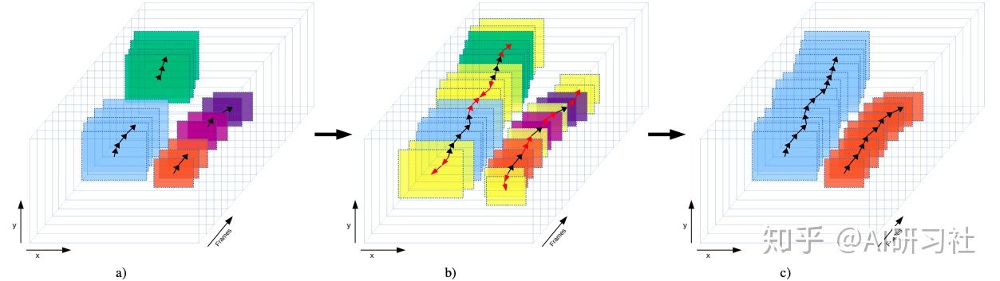 
V-IOU Tracker

加入了单目标跟踪模块后,设计简单的V-IOU Tracker在MOT Challenge排行榜上也能取得不错的成绩.

### MOT-RNN
作为使用深度学习解决MOT问题的一次尝试,Anton Milan等大佬提出了使用RNN进行目标状态预测与数据关联的方法——MOT-RNN[23]（MOT using RNN, AAAI2017, A. Milan et al.）.这也是第一篇尝试以端到端的方式完成在线多目标跟踪的文章.

目标的状态预测是一个连续空间的问题,而数据关联又是一个离散空间的问题,如何把这两个问题放到神经网络里做确实是一个让人头疼的问题.尤其是数据关联问题存在着诸多限制,比如需要满足输出的结果不得出现一对多的情况.作者认为,LSTM的非线性变化以及它强大的记忆能力使得这些限制也能通过学习而满足.

遗憾的是,尽管基于RNN的方法的速度远快于大部分同类方法,它的跟踪效果与先进的方法相比相形见绌.MOT-RNN可以进行进一步完善的点有很多,比如很重要的目标的外观建模,以及如何将检测器也加入可优化的部分.

 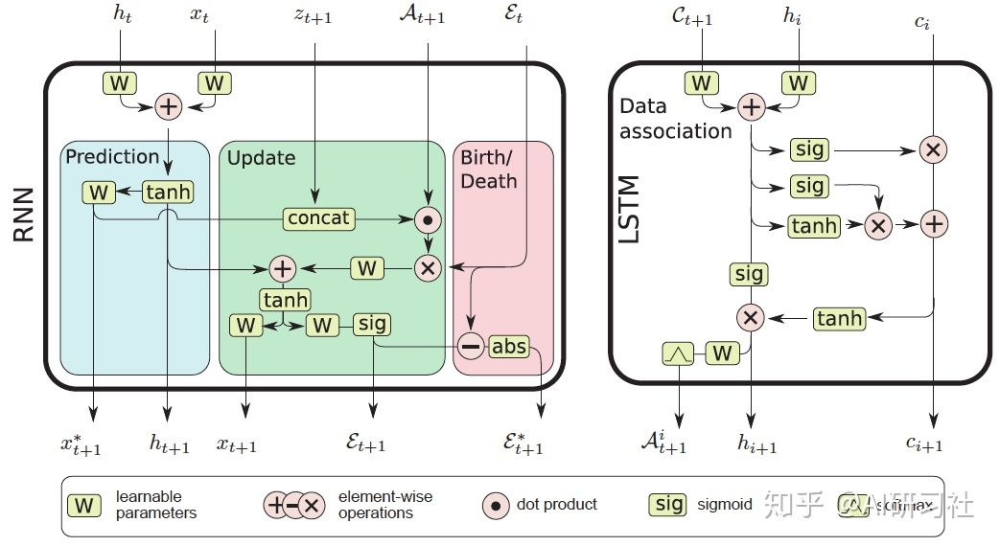 
左:用于目标状态预测的RNN；右:用于数据关联（匹配）的LSTM

后续的工作中,陆续出现了一些同样尝试使用神经网络解决多目标跟踪问题的方法（不包括使用CNN做目标检测）,如JDT（简称是我瞎起的）[24],DMAN[25],DeepMOT[26],TBA[27],TAMA[28]等等.尽管性能上还与基于传统算法的方法有不小的差距,但其方法的创新值得鼓励与学习.

一点闲话:实际上,多目标跟踪还有一个更复杂的问题——多相机多目标跟踪（MTMCT,Multi-Target Multi-Camera Tracking）[30].今年的四月份,笔者还在参加DukeMTMCT CVPR Workshop Challenge.不幸的是,由于某些不可控因素,这场比赛的测试集无法发布,比赛也只能中止.不仅如此,已经公开的DukeMTMC训练集也下线了,甚至[30]的作者Ergys Ristani在Github上的DeepCC代码也被删除.刚从单目标跟踪研究失败的阴影中走出来斗志昂扬精神百倍甚至已经开始拿DukeMTMC训练模型的笔者又产生了卷铺盖退学的想法（捂脸）……DukeMTMC即便拆分开来作为八个单相机多目标跟踪的数据集,也是一个相当高质量、大规模的数据集了.如果类似这样的数据集能够多起来,拥有了数据量加成的多目标跟踪研究又会是怎样一幅景象呢？

# 相关资源
## 文献
- VOT文献整理与模型效果排行 https://github.com/foolwood/benchmark_results
- MOT文献整理 https://github.com/SpyderXu/multi-object-tracking-paper-list
- 20年论文整理 https://github.com/foolwood/benchmark_results/blob/master/README.md

## 项目
- 商汤的VOT开源项目——PySOT https://github.com/STVIR/pysot
## 数据集与排行
### 单目标
- LaSOT https://cis.temple.edu/lasot/
- TrackingNet https://tracking-net.org/
- OTB Dataset http://cvlab.hanyang.ac.kr/tracker_benchmark/datasets.html
- UAV123 https://ivul.kaust.edu.sa/Pages/Dataset-UAV123.aspx
- VOT Challenge http://votchallenge.net
### 多目标
- PathTrack http://people.ee.ethz.ch/~daid/pathtrack/
- ViDrone http://aiskyeye.com/views/index
- DukeMTMC（已关闭） http://vision.cs.duke.edu/DukeMTMC/
- UA-DETRAC http://detrac-db.rit.albany.edu/
- MOT Challenge https://motchallenge.net
## 专栏
- 深度学习和目标跟踪 https://zhuanlan.zhihu.com/DCF-tracking
- 带你入门多目标跟踪 https://zhuanlan.zhihu.com/c_1102212337087401984
# 参考文献
[1] Bolme, D. S., Beveridge, J. R., Draper, B. A., & Lui, Y. M. (2010, June). Visual object tracking using adaptive correlation filters. In 2010 IEEE Computer Society Conference on Computer Vision and Pattern Recognition (pp. 2544-2550). IEEE.
[2] Henriques, J. F., Caseiro, R., Martins, P., & Batista, J. (2014). High-speed tracking with kernelized correlation filters. IEEE transactions on pattern analysis and machine intelligence, 37(3), 583-596.
[3] Danelljan, Martin, et al. "Accurate scale estimation for robust visual tracking." British Machine Vision Conference, Nottingham, September 1-5, 2014. BMVA Press, 2014.
[4] Danelljan, M., Hager, G., Shahbaz Khan, F., & Felsberg, M. (2015). Learning spatially regularized correlation filters for visual tracking. In Proceedings of the IEEE international conference on computer vision (pp. 4310-4318).
[5] Danelljan, Martin, et al. "Convolutional features for correlation filter based visual tracking." Proceedings of the IEEE International Conference on Computer Vision Workshops. 2015.
[6] Danelljan, Martin, et al. "Beyond correlation filters: Learning continuous convolution operators for visual tracking." European Conference on Computer Vision. Springer, Cham, 2016.
[7] Danelljan, Martin, et al. "Eco: Efficient convolution operators for tracking." Proceedings of the IEEE conference on computer vision and pattern recognition. 2017.
[8] Bertinetto, L., Valmadre, J., Henriques, J. F., Vedaldi, A., & Torr, P. H. (2016, October). Fully-convolutional siamese networks for object tracking. In European conference on computer vision (pp. 850-865). Springer, Cham.
[9] Tao, Ran, Efstratios Gavves, and Arnold WM Smeulders. "Siamese instance search for tracking." Proceedings of the IEEE conference on computer vision and pattern recognition. 2016.
[10] Li, Bo, et al. "High performance visual tracking with siamese region proposal network." Proceedings of the IEEE Conference on Computer Vision and Pattern Recognition. 2018.
[11] Zhu, Zheng, et al. "Distractor-aware siamese networks for visual object tracking." Proceedings of the European Conference on Computer Vision (ECCV). 2018.
[12] Zhang, Zhipeng, and Houwen Peng. "Deeper and wider siamese networks for real-time visual tracking." Proceedings of the IEEE Conference on Computer Vision and Pattern Recognition. 2019.
[13] Li, B., Wu, W., Wang, Q., Zhang, F., Xing, J., & Yan, J. (2018). SiamRPN++: Evolution of Siamese Visual Tracking with Very Deep Networks. arXiv preprint arXiv:1812.11703.
[14] Nam, Hyeonseob, and Bohyung Han. "Learning multi-domain convolutional neural networks for visual tracking." Proceedings of the IEEE conference on computer vision and pattern recognition. 2016.
[15] Nam, Hyeonseob, Mooyeol Baek, and Bohyung Han. "Modeling and propagating cnns in a tree structure for visual tracking." arXiv preprint arXiv:1608.07242 (2016).
[16] Fan, Heng, and Haibin Ling. "Sanet: Structure-aware network for visual tracking." Proceedings of the IEEE Conference on Computer Vision and Pattern Recognition Workshops. 2017.
[17] Song, Yibing, et al. "CREST: Convolutional residual learning for visual tracking." Proceedings of the IEEE International Conference on Computer Vision. 2017.
[18] Song, Yibing, et al. "VITAL: Visual tracking via adversarial learning." Proceedings of the IEEE Conference on Computer Vision and Pattern Recognition. 2018.
[19] Bewley, Alex, et al. "Simple online and realtime tracking." 2016 IEEE International Conference on Image Processing (ICIP). IEEE, 2016.
[20] Wojke, Nicolai, Alex Bewley, and Dietrich Paulus. "Simple online and realtime tracking with a deep association metric." 2017 IEEE International Conference on Image Processing (ICIP). IEEE, 2017.
[21] Bochinski, Erik, Volker Eiselein, and Thomas Sikora. "High-speed tracking-by-detection without using image information." 2017 14th IEEE International Conference on Advanced Video and Signal Based Surveillance (AVSS). IEEE, 2017.
[22] Bochinski, Erik, Tobias Senst, and Thomas Sikora. "Extending IOU based multi-object tracking by visual information." 2018 15th IEEE International Conference on Advanced Video and Signal Based Surveillance (AVSS). IEEE, 2018.
[23] Milan, Anton, et al. "Online multi-target tracking using recurrent neural networks." Thirty-First AAAI Conference on Artificial Intelligence. 2017.
[24] Kieritz, Hilke, Wolfgang Hubner, and Michael Arens. "Joint detection and online multi-object tracking." Proceedings of the IEEE Conference on Computer Vision and Pattern Recognition Workshops. 2018.
[25] Zhu, Ji, et al. "Online multi-object tracking with dual matching attention networks." Proceedings of the European Conference on Computer Vision (ECCV). 2018.
[26] Xu, Yihong, et al. "DeepMOT: A Differentiable Framework for Training Multiple Object Trackers." arXiv preprint arXiv:1906.06618 (2019).
[27] He, Zhen, et al. "Tracking by Animation: Unsupervised Learning of Multi-Object Attentive Trackers." Proceedings of the IEEE Conference on Computer Vision and Pattern Recognition. 2019.
[28] Yoon, Young-Chul, et al. "Online Multiple Pedestrian Tracking using Deep Temporal Appearance Matching Association." arXiv preprint arXiv:1907.00831 (2019).
[29] Luo, Wenhan, et al. "Multiple object tracking: A literature review." arXiv preprint arXiv:1409.7618 (2014).
[30] Ristani, Ergys, et al. "Performance measures and a data set for multi-target, multi-camera tracking." European Conference on Computer Vision. Springer, Cham, 2016.